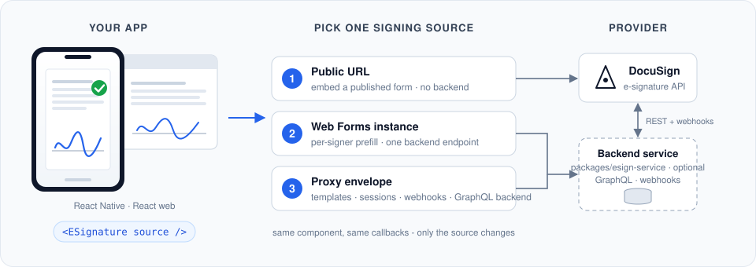

# blink-esign

[](https://github.com/blinkbitcoin/blink-esign/actions/workflows/test.yml)
[](https://github.com/blinkbitcoin/blink-esign/actions/workflows/e2e.yml)
[](https://github.com/blinkbitcoin/blink-esign/actions/workflows/publish.yml)
[](#development)
[](package.json)
[](packages/esign-core/tsconfig.json)
[](LICENSE)

<p align="center">
  
</p>

Embedded e-signing for React Native and React web apps. One `ESignature`
component, three integration modes - **you only need the parts for your
mode**, and for two of the three that is a single small package:

| Mode | What it is | What your app installs | Backend required |
|------|-----------|------------------------|------------------|
| **1. Public URL** | A published public form URL embedded directly | One package via the Apollo-free `/webform` entry - **no Apollo, no GraphQL** | **None** |
| **2. Web Forms instances** | Prefilled per-signer forms; your backend mints an instance URL with one API call | Same minimal `/webform` entry | One authenticated endpoint on *your* backend (or run this repo's service) |
| **3. Proxy envelope** | Full envelope orchestration: templates, per-recipient sessions, restart on expiry, webhook status sync | The package + `@apollo/client` + `graphql` | This repo's backend service (`apps/api`) |

The GraphQL backend, Apollo wiring, and provider adapters in this repo exist
for **mode 3 only**. If you need modes 1 or 2, none of that ships with you -
the [Integration](#integration) section walks each mode from simplest up.

## Integration

Every mode drives the **same component with the same callbacks** - the only
thing that changes is the `SigningSource` you pass in:

```tsx
<ESignature source={source} onComplete={…} onError={…} onCancel={…} />
```

The modes below go from simplest to most capable. **Start with the first
one that covers your needs.**

### 1. Public URL - the simplest (no backend, no credentials)

**Use when:** every signer gets the same form and you don't need per-signer
prefill - you just publish the form in the DocuSign Web Forms builder and
embed its public URL.

Install the package and the two WebView peers - nothing else:

```sh
npm i @blinkbitcoin/esign-react-native react-native-webview @react-native-community/netinfo
# note: no @apollo/client, no graphql - not needed for modes 1 and 2
```

```tsx
import { ESignature, createPublicUrlSource } from '@blinkbitcoin/esign-react-native/webform';

const source = createPublicUrlSource({ url: 'https://your-published-form-url' });
```

That's the whole integration: the component embeds the URL in a WebView and
your callbacks fire on completion/cancel/error.

### 2. Web Forms instances - adds per-signer prefill (one backend endpoint)

**Use when:** you want each signer's data prefilled into the form, or need to
know *which* signer completed it. DocuSign requires minting a short-lived
**instance URL** per signer, and that API call carries your DocuSign
credentials - so it belongs on a backend, not in the app.

1. Add **one authenticated endpoint to your own backend** that calls
   DocuSign's `createInstance` with the signer's `clientUserId` + prefill
   values and returns `{ url }`. (This repo's service implements it as
   `POST /webform/instance` if you'd rather run it than write it - but any
   backend able to make one REST call works.)
2. Install exactly as in mode 1 (same minimal packages, still no Apollo).
3. Point the source at your endpoint:

```tsx
import { ESignature, createWebFormsSource } from '@blinkbitcoin/esign-react-native/webform';

const source = createWebFormsSource({
  createInstance: () =>
    fetch('https://your-backend.example.com/webform/instance', {
      method: 'POST',
      headers: { Authorization: `Bearer ${token}` },
    }).then(r => r.json()), // -> { url }
});
```

Modes 1 and 2 import from the `/webform` subpath, which is **Apollo-free by
construction** (a guard test walks the import graph to keep it that way).
Web Forms specifics - event model, real-DocuSign caveats:
[docs/integration/webforms.md](docs/integration/webforms.md).

### 3. Proxy envelope - full orchestration (this repo's backend service)

**Use when:** you need real envelope workflows: creation from DocuSign
templates, a distinct session per recipient, session restart after expiry,
and webhook-driven status tracking in a database. This is the mode the rest
of this repo exists for - `apps/api` (GraphQL service, provider adapters,
webhooks) plus the Apollo client wiring.

1. Deploy this repo's backend ([apps/api](apps/api/README.md)).
2. Install the package **plus** the Apollo peers:

```sh
npm i @blinkbitcoin/esign-react-native react-native-webview @react-native-community/netinfo \
      @apollo/client graphql
```

3. Wire the client and source from the package root (not `/webform`):

```tsx
import {
  ESignature,
  createESignApolloClient,
  createProxySigningSource,
} from '@blinkbitcoin/esign-react-native';
import { ApolloProvider } from '@apollo/client/react';

const client = createESignApolloClient({
  uri: 'https://your-backend.example.com/graphql',
  getAuthToken: () => readTokenFromSecureStorage(),
});
const source = createProxySigningSource({
  client,
  contractType: 'loan_agreement',
  recipient: { name, email },
});

<ApolloProvider client={client}>
  <ESignature source={source} onComplete={…} onError={…} onCancel={…} />
</ApolloProvider>;
```

### Web apps

The web package (`@blinkbitcoin/esign-react`) mirrors all of the above for
React DOM apps (iframe instead of WebView), and adds a DocuSign.js source
for real Web Forms embedding on web - see its
[README](packages/esign-react/README.md).

Packages publish to GitHub Packages under the `blinkbitcoin` org - registry
setup: [docs/integration/consuming.md](docs/integration/consuming.md).

## Repository Layout

Ordered by how likely you are to need each part:

| Path | What lives there |
|------|------------------|
| [`packages/esign-react-native/`](packages/esign-react-native/README.md) | The React Native library you install: the `ESignature` component and the signing sources. |
| [`packages/esign-react/`](packages/esign-react/README.md) | The React web library: the same component and sources for browser apps, embedding with an iframe instead of a WebView. |
| [`packages/esign-core/`](packages/esign-core/README.md) | The shared core both libraries build on: the `SigningSource` abstraction and event interpreters, plus the GraphQL client pieces used by mode 3. It arrives automatically as a dependency - you never install it directly. |
| [`apps/api/`](apps/api/README.md) | The backend service for mode 3: a GraphQL API that creates envelopes through provider adapters (DocuSign and a mock), persists status in PostgreSQL, and receives provider webhooks. Not needed for modes 1 and 2. |
| [`examples/react-native-demo/`](examples/react-native-demo/README.md) | A complete React Native app hosting the component. Used for manual testing, and the mobile end-to-end suites drive it. |
| [`examples/react-demo/`](examples/react-demo/README.md) | The same for the browser: a small React app hosting the web component, driven by the browser end-to-end suites. |
| `docs/` | Documentation of how everything currently works - start at [docs/index.md](docs/index.md). |

## Development

Only needed if you're working on the packages or the backend themselves -
**consuming the packages requires none of this** (see
[Integration](#integration) above).

One-time setup:

```sh
make install                             # npm ci across all workspaces (also installs git hooks)
direnv allow . && direnv allow apps/api  # once per machine (loads env + nix flake dev shell)
```

**Working on the libraries** requires nothing else - no backend, no
database. The unit suites, lint, and typecheck run standalone:

```sh
make test
```

**Running the demo apps** is where the backend comes in: the demos sign
against a locally running service and its Postgres. By default it uses the
**mock provider**, so no DocuSign account or credentials are needed:

```sh
make db-up migrate backend              # dev Postgres + migrations + server (:4000)

# in a new terminal:
make start                              # Metro
make ios                                # or: make android
make web                                # or the web demo (Vite)
```

**Real DocuSign** stays opt-in: configure credentials per
[docs/integration/docusign-proxy.md](docs/integration/docusign-proxy.md), then `make test-live`
verifies the API contracts against a demo account (it skips itself when no
credentials are set).

`make help` lists all targets (thin wrappers over the npm workspace scripts):

| Target | Purpose |
|--------|---------|
| `make test` | Unit suites + lint + typecheck + format check |
| `make unit` / `make coverage` | Test suites (100% coverage enforced on packages + backend; demos floored at current level) |
| `make check-code` | Lint + typecheck + format check only |
| `make build` | Build the library (react-native-builder-bob) |
| `make e2e-backend` / `make e2e-web` | Backend / browser E2E: test DB up → migrate → tests → teardown |
| `make e2e-mobile` / `make e2e-mobile-android` | Maestro E2E against a running stack |
| `make test-live` | Opt-in live DocuSign API verification (skips without credentials) |
| `make pods` | iOS CocoaPods install |

See [docs/development-guide.md](docs/development-guide.md) for full setup,
environment variables, and troubleshooting, and [CONTRIBUTING.md](CONTRIBUTING.md)
for commit conventions (Conventional Commits, enforced by hooks + CI), git
hooks, and the PR checklist.
