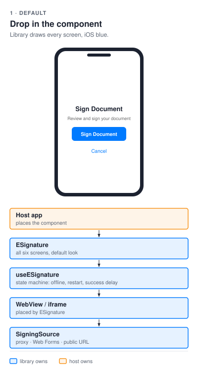
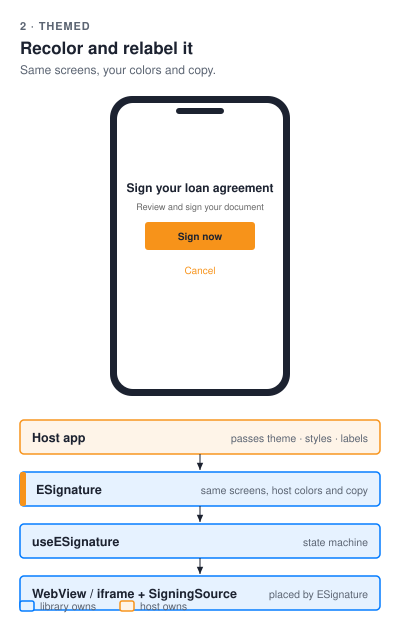
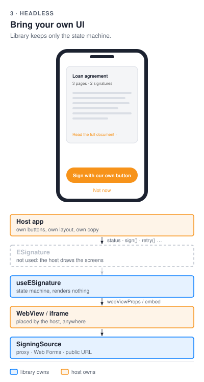

# esign

[](https://github.com/blinkbitcoin/esign/actions/workflows/ci.yml?query=branch%3Amain)
[](https://github.com/blinkbitcoin/esign/actions/workflows/ci.yml?query=branch%3Amain)
[](https://github.com/blinkbitcoin/esign/actions/workflows/ci.yml?query=branch%3Amain)
[](LICENSE)

<sub>E2E covers backend, web, Android and the iOS simulator suite, see [CI/CD](docs/development-guide.md#ios-e2e-and-the-macos-runner).</sub>

<p align="center">
  
</p>

Embedded e-signing for React Native and React web apps. One `ESignature`
component, three integration modes - **you only need the parts for your
mode**, and for two of the three that is a single small package:

| Mode | What it is | What your app installs | Backend required |
|------|-----------|------------------------|------------------|
| **1. Public URL** | A published public form<br>URL embedded directly | One package via the<br>Apollo-free `/webform`<br>entry - **no Apollo,<br>no GraphQL** | **None** |
| **2. Web Forms<br>instances** | Prefilled per-signer forms<br>(read-only fields locked);<br>your backend mints an<br>instance URL with one<br>API call | Same minimal `/webform`<br>entry | One mint endpoint,<br>either tier: in-process<br>with `@blinkbitcoin/esign-node`,<br>or deploy<br>`@blinkbitcoin/esign-service`<br>(**no database**) |
| **3. Proxy envelope** | Full envelope orchestration:<br>templates, per-recipient<br>sessions, restart on expiry,<br>webhook status sync | The package +<br>`@apollo/client` +<br>`graphql` | `@blinkbitcoin/esign-service`<br>with `DATABASE_URL`, or the<br>envelope domain of<br>`@blinkbitcoin/esign-node`<br>in your own Node API |

The GraphQL API and the Apollo wiring exist for **mode 3 only**. If you need
modes 1 or 2, none of that ships with you: the mint that mode 2 needs runs
either inside your own Node API or in this repo's service, with **no database
at all** ([Backend options](#backend-options)). The [Integration](#integration)
section walks each mode from simplest up.

**Which mode?** Nothing to lock and no per-signer data: mode 1. Values the
signer must not change (amounts, rates, dates set by you): mode 2 - the
only mode that locks fields, and it needs one call on your backend. A
document workflow with per-recipient sessions, restarts and status
tracking: mode 3. **Reading path for mode 2 (locked terms):**
[docs/integration/locked-terms.md](docs/integration/locked-terms.md) (the
recipe, backend + app) → [docs/integration/docusign-lessons.md](docs/integration/docusign-lessons.md)
(the rules, one page) → [docs/integration/webforms.md](docs/integration/webforms.md)
(the details) → [`examples/mint-only-demo`](examples/mint-only-demo/README.md)
(the API side, runnable).

**Who are you?** Three paths through this repository:

| You are | Your path |
|---------|-----------|
| **App developer /<br>integrator** | [Integration](#integration) - the three modes, same component<br>[consuming.md](docs/integration/consuming.md) - registry setup and the minimal install<br>[locked-terms.md](docs/integration/locked-terms.md) - the mode 2 recipe, backend + app |
| **Backend<br>developer** | [The in-process mint preset](packages/esign-node/README.md#the-http-surface-blinkbitcoinesign-nodeexpress) - routes in your own API<br>[`examples/mint-only-demo`](examples/mint-only-demo/README.md) - a runnable API that mints<br>[Runbook: backend developer](docs/operations/production.md#3-backend-developer) - what to build once |
| **DevOps<br>engineer** | [Backend options](#backend-options) - the two tiers, side by side<br>[Deploy table](packages/esign-service/README.md#deploy) - the copy-paste per target<br>[Runbook: DevOps](docs/operations/production.md#4-devops) - env, keys, boot guard, health |

## Integration

Every mode drives the **same component with the same callbacks** - the only
thing that changes is the `SigningSource` you pass in:

```tsx
<ESignature source={source} onComplete={…} onError={…} onCancel={…} />
```

The modes below go from simplest to most capable. **Start with the first
one that covers your needs.**

### 1. Public URL - the simplest (no backend, no credentials)

**Use when:** every signer gets the same form and you don't need per-signer
prefill - you just publish the form in the DocuSign Web Forms builder and
embed its public URL.

Install the package and the two WebView peers - nothing else:

```sh
npm i @blinkbitcoin/esign-react-native react-native-webview @react-native-community/netinfo
# note: no @apollo/client, no graphql - not needed for modes 1 and 2
```

```tsx
import { ESignature, createPublicUrlSource } from '@blinkbitcoin/esign-react-native/webform';

const source = createPublicUrlSource({ url: 'https://your-published-form-url' });
```

That's the whole integration: the component embeds the URL in a WebView and
your callbacks fire on completion/cancel/error.

### 2. Web Forms instances - adds per-signer prefill (one backend endpoint)

**Use when:** you want each signer's data prefilled into the form, need
values **the signer cannot change** (the fields marked read-only in the
builder show the minted values locked), or need to know *which* signer
completed it. DocuSign requires minting a short-lived **instance URL** per
signer, and that API call carries your DocuSign credentials - so it belongs
on a backend, not in the app. One rule from the live runs: locked fields
must be **Text** (or Dropdown) fields fed strings - a read-only Number or
Date field makes DocuSign refuse the submission
([lessons](docs/integration/docusign-lessons.md)).

1. Add **one authenticated endpoint to your own backend** that calls
   DocuSign's `createInstance` with the signer's `clientUserId` + prefill
   values and returns `{ url }` - one call from `@blinkbitcoin/esign-node`
   (`createWebFormInstance`) in any Node backend, or this repo's service,
   which exposes exactly that as `POST /webform/instance`.
2. Install exactly as in mode 1 (same minimal packages, still no Apollo).
3. Point the source at your endpoint:

```tsx
import { ESignature, createWebFormsSource } from '@blinkbitcoin/esign-react-native/webform';

const source = createWebFormsSource({
  // your endpoint + the app's own session token; the backend mints with
  // @blinkbitcoin/esign-node, so read-only fields come back locked
  mint: { url: 'https://your-backend.example.com/webform/instance', getAuthToken },
  prefill: { number_of_units: '1000', settlement_amount_btc: '0.01268231' }, // locked fields: strings
});
// A GraphQL mutation instead of a POST endpoint: createWebFormsSource({ createInstance })
```

Completion reaches the app through the instance's return URL: your backend
serves the small bridge page (`renderSigningReturnBridge`) that the
component listens to - no DocuSign.js, works in a plain WebView. The whole
recipe, backend and app: [docs/integration/locked-terms.md](docs/integration/locked-terms.md).

Modes 1 and 2 import from the `/webform` subpath, which is **Apollo-free by
construction** (a guard test walks the import graph to keep it that way).
When installing from GitHub Packages add `--omit=peer`, otherwise npm also
drops the unused Apollo peers into `node_modules` - the registry omits
`peerDependenciesMeta` (details in
[docs/integration/consuming.md](docs/integration/consuming.md)).
Web Forms specifics - event model, real-DocuSign caveats:
[docs/integration/webforms.md](docs/integration/webforms.md).

### 3. Proxy envelope - full orchestration (this repo's backend service)

**Use when:** you need real envelope workflows: creation from DocuSign
templates, a distinct session per recipient, session restart after expiry,
and webhook-driven status tracking in a database. This is the mode the rest
of this repo exists for - `packages/esign-service` (GraphQL service, provider adapters,
webhooks) plus the Apollo client wiring.

1. Deploy this repo's backend ([packages/esign-service](packages/esign-service/README.md)).
2. Install the package **plus** the Apollo peers:

```sh
npm i @blinkbitcoin/esign-react-native react-native-webview @react-native-community/netinfo \
      @apollo/client graphql
```

3. Wire the client and source from the package root (not `/webform`):

```tsx
import {
  ESignature,
  createESignApolloClient,
  createProxySigningSource,
} from '@blinkbitcoin/esign-react-native';
import { ApolloProvider } from '@apollo/client/react';

const client = createESignApolloClient({
  uri: 'https://your-backend.example.com/graphql',
  getAuthToken: () => readTokenFromSecureStorage(),
});
const source = createProxySigningSource({
  client,
  contractType: 'loan_agreement',
  recipient: { name, email },
});

<ApolloProvider client={client}>
  <ESignature source={source} onComplete={…} onError={…} onCancel={…} />
</ApolloProvider>;
```

### Web apps

The web package (`@blinkbitcoin/esign-react`) mirrors all of the above for
React DOM apps (iframe instead of WebView), and adds a DocuSign.js source
for real Web Forms embedding on web - see its
[README](packages/esign-react/README.md).

Packages publish to GitHub Packages under the `blinkbitcoin` org - registry
setup: [docs/integration/consuming.md](docs/integration/consuming.md).

### The UI: component or hook

Independent of the signing mode above, pick how much of the screen the
library draws. Same state machine in every column; the host takes over
more from left to right.

| Default | Themed | Headless |
|---|---|---|
|  |  |  |
| `<ESignature source={source} … />` | `theme` · `styles` · `labels` on `ESignature` | `useESignature` + your own `WebView` / `iframe` |

Details and code for each path: the package READMEs
([RN](packages/esign-react-native/README.md#integration-paths),
[web](packages/esign-react/README.md#integration-paths)).

## Backend options

Modes 2 and 3 need a mint on a backend you control, and there are exactly two
tiers to choose between. **The app code is identical for both** - the same
`SigningSource` calls one endpoint and embeds the URL it gets back.

| Tier | What you run | What your API must provide | Capabilities | Copy-paste |
|------|--------------|----------------------------|--------------|------------|
| **In-process**<br>`@blinkbitcoin/esign-node` | The package inside<br>your own Node API<br>(router or Fetch<br>handler) | Your own session check<br>(`authenticate`), and the<br>locked terms from the<br>`prefill` hook - which can<br>reject a mint by throwing<br>`Errors.validationError` | Mint; the envelope<br>domain too, over<br>your own store | [The mint-only preset](packages/esign-node/README.md#mint-only-the-whole-surface-in-three-lines) |
| **Deployable**<br>`@blinkbitcoin/esign-service` | The package or the<br>`ghcr.io/blinkbitcoin/esign-service`<br>image, as a function<br>or a container | `SESSION_JWKS_URL` or<br>`SESSION_HS256_SECRET`<br>(who the caller is), plus<br>`TERMS_URL` when the<br>locked terms come from<br>your data | Mint always on;<br>envelopes, webhooks<br>and GraphQL with<br>`DATABASE_URL` | [Deploy table](packages/esign-service/README.md#deploy) |

**Mode 2 needs no database with the service**: the mint is always on, and
`DATABASE_URL` only adds the envelope half. Deploy targets are a Node
container, Vercel, a Cloudflare Worker (mint only), Kubernetes, or Lambda via
the same image - one row each, with the commands, in the service's
[Deploy table](packages/esign-service/README.md#deploy).

Taking either tier live - DocuSign go-live, the environment, the private key
per platform, the boot guard and the verification checklist - is the runbook:
[docs/operations/production.md](docs/operations/production.md).

## Repository Layout

Ordered by how likely you are to need each part:

| Path | What lives there |
|------|------------------|
| [`packages/esign-react-native/`](packages/esign-react-native/README.md) | The React Native library you install:<br>the `ESignature` component and the signing sources. |
| [`packages/esign-react/`](packages/esign-react/README.md) | The React web library: the same component and sources for<br>browser apps, embedding with an iframe instead of a WebView. |
| [`packages/esign-core/`](packages/esign-core/README.md) | The shared core both libraries build on: the `SigningSource`<br>abstraction and event interpreters, plus the GraphQL client<br>pieces used by mode 3. It arrives automatically as a<br>dependency - you never install it directly. |
| [`packages/esign-node/`](packages/esign-node/README.md) | The Node-only server half for your own backend: mint Web Forms<br>instances with locked prefill in one call, or run the whole<br>envelope domain (mode 3) over your own store, as a Fetch<br>handler or an Express router. The service below is built on it. |
| [`examples/mint-only-demo/`](examples/mint-only-demo/README.md) | Server shape for most hosts: your existing API adds one<br>mutation that mints a locked Web Forms instance. |
| [`examples/serverless-handler-demo/`](examples/serverless-handler-demo/README.md) | Server shape for route handlers and edge functions: the<br>package's mint and webhook handlers, `Request → Response`. |
| [`packages/esign-service/`](packages/esign-service/README.md) | The whole service as one deployable: it always mints, and<br>adds the GraphQL API, the provider webhook and the<br>PostgreSQL store when `DATABASE_URL` is set. Needed only<br>when you deploy a backend rather than mint from your own. |
| [`examples/react-native-demo/`](examples/react-native-demo/README.md) | A complete React Native app hosting the component. Used for<br>manual testing, and the mobile end-to-end suites drive it. |
| [`examples/react-demo/`](examples/react-demo/README.md) | The same for the browser: a small React app hosting the web<br>component, driven by the browser end-to-end suites. |
| `docs/` | Documentation of how everything currently works -<br>start at [docs/index.md](docs/index.md); upgrading notes in<br>[docs/upgrading.md](docs/upgrading.md). |
| `scripts/` | The CI / E2E / release shell and node the Makefile and the<br>workflows run; its logic is a tested `tooling` workspace. |

## Development

Only needed if you're working on the packages or the backend themselves -
**consuming the packages requires none of this** (see
[Integration](#integration) above).

One-time setup:

```sh
make install                             # npm ci across all workspaces (also installs git hooks)
direnv allow . && direnv allow packages/esign-service  # once per machine (loads env + nix flake dev shell)
```

**Working on the libraries** requires nothing else - no backend, no
database. The unit suites, lint, and typecheck run standalone:

```sh
make test
```

**Running the demo apps** is where the backend comes in: the demos sign
against a locally running service and its Postgres. By default it uses the
**mock provider**, so no DocuSign account or credentials are needed:

```sh
make db-up migrate backend              # dev Postgres + migrations + server (:4100)

# in a new terminal:
make start                              # Metro
make ios                                # or: make android
make web                                # or the web demo (Vite)
```

**Real DocuSign** stays opt-in: configure credentials per
[docs/integration/docusign-proxy.md](docs/integration/docusign-proxy.md), then `make test-live`
verifies the API contracts against a demo account (it skips itself when no
credentials are set).

`make help` lists all targets (thin wrappers over the npm workspace scripts):

| Target | Purpose |
|--------|---------|
| `make test` | Unit suites + lint + typecheck + format check |
| `make unit`<br>`make coverage` | Test suites (100% coverage on packages + backend + `scripts/lib`) |
| `make coverage-badge` | Coverage badge + HTML report from the last `make coverage` run |
| `make check-code` | Lint + typecheck + format check only |
| `make build` | Build the packages (bob for RN, tsup for core/node/web,<br>tsc for the service) |
| `make e2e-backend`<br>`make e2e-web` | Backend / browser E2E: test DB up → migrate → tests → teardown (`e2e-web`<br>builds the libraries first and bundles the demo against their dist) |
| `make e2e-ios`<br>`make e2e-android` | Maestro E2E against a running stack |
| `make e2e-ios-local`<br>`make e2e-android-local` | The whole mobile stack in one command (DB, backend, .app or APK,<br>Metro, Maestro, teardown); iOS boots a simulator, Android needs a<br>running emulator. The steps: `e2e-backend-up`, `ios-build` /<br>`android-build`, `e2e-metro-up`, `e2e-ios` / `e2e-android` |
| `make check-ci` | Lint the CI itself: actionlint on the workflows, shellcheck on `scripts/**` |
| `make test-live` | Opt-in live DocuSign API verification (skips without credentials) |
| `make e2e-live`<br>`make e2e-ios-live` | Live journeys against real DocuSign (needs `make docusign-env`): the<br>locked Web Form submitted and signed inside the web component + a<br>proxy-mode signature; the same Web Form journey in the React Native<br>demo's WebView (booted simulator) |
| `make live-web`<br>`make live-ios`<br>`make live-android` | The web demo / the RN demo on the attached phone against real<br>DocuSign, interactive: `.env`, a Tailscale Funnel public URL for<br>Connect webhooks, the service, the demo; waits for the manual rows<br>of `docs/integration/docusign-proxy.md` section 5, Ctrl-C tears down |
| `make pods` | iOS CocoaPods install |

Coverage is 100% everywhere, the demo apps included. The HTML report
lands in `coverage/report/index.html`; CI publishes
the badge per branch to `gh-pages/badges/<branch>/` and uploads the report as
the `coverage-report` artifact of every run.

See [docs/development-guide.md](docs/development-guide.md) for full setup,
environment variables, and troubleshooting.

## Documentation and contributing

- [docs/index.md](docs/index.md) - the map of every page, by what you are doing
- [docs/integration/](docs/integration/consuming.md) - using the packages: registry, the three modes, [locked terms](docs/integration/locked-terms.md), [error codes](docs/integration/error-codes.md), DocuSign
- [docs/architecture/](docs/architecture/source-tree.md) - how it works inside, [security](docs/architecture/security.md), the [nine diagrams](docs/diagrams/README.md)
- [docs/operations/](docs/operations/live-e2e-ci.md) - the live DocuSign job in CI; [releasing](docs/releasing.md) and [upgrading](docs/upgrading.md)
- [CONTRIBUTING.md](CONTRIBUTING.md) - Conventional Commits (enforced by hooks and CI), the quality gates, the PR checklist
- [SECURITY.md](SECURITY.md) - reporting a vulnerability privately
- [LICENSE](LICENSE) - MIT
