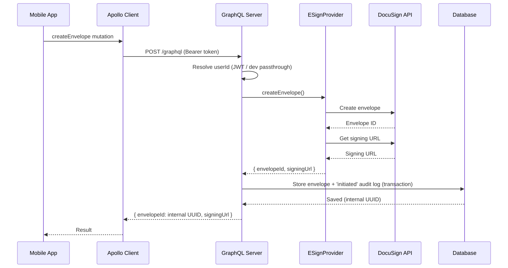

# API Contracts - Backend

**Part:** backend
**Updated:** 2026-09-14

## Overview

The backend exposes four API surfaces. Which of them exist is decided by the
environment (`src/capabilities.ts`): the mint half is always served, and
`/graphql` + `/webhook/esign` exist only when `DATABASE_URL` turns envelope
orchestration on. `GET /health` reports which.

1. **REST Web Forms** - `POST /webform/instance` (authenticated) mints a
   prefilled DocuSign Web Forms instance via the configured provider (always).
   Under `ESIGN_MINT_MODE=envelope` the same slot is `POST /envelope/instance`,
   which creates one envelope from the template and answers its signing URL
2. **HTML signing pages** - `GET /signing/return` (the DocuSign return-URL
   bridge, always); `GET /signing/mock/:id`, `GET /signing/mock-webform/:id`
   (mock ceremonies for E2E, only with the mock provider and `ESIGN_MOCK_PAGES`
   not `false`)
3. **GraphQL API** - client interface at `/graphql` (with `DATABASE_URL`)
4. **REST Webhook** - e-sign provider callbacks at `/webhook/esign`
   (with `DATABASE_URL`)

## GraphQL API

### Endpoint
```
POST /graphql
Content-Type: application/json
Authorization: Bearer <token>
```

### Schema

```graphql
type Query {
  health: HealthCheck!
  envelope(id: String!): Envelope
  auditLogs(envelopeId: String!): [AuditLog!]!
}

type Mutation {
  createEnvelope(input: CreateEnvelopeInput!): EnvelopeResult!
  getSigningUrl(input: GetSigningUrlInput!): SigningUrlResult!
}

type HealthCheck {
  status: String!
  timestamp: String!
}

input RecipientInput {
  name: String!
  email: String!
}

input CreateEnvelopeInput {
  contractType: String!
  recipient: RecipientInput!
}

type EnvelopeResult {
  envelopeId: String!   # Internal UUID - never the provider's envelope ID
  signingUrl: String!
}

input GetSigningUrlInput {
  envelopeId: String!
  recipient: RecipientInput!
}

type SigningUrlResult {
  signingUrl: String!
}

# SECURITY: providerEnvelopeId is intentionally NOT exposed
type Envelope {
  id: String!
  status: String!
  contractType: String!
  createdAt: String!
}

type AuditLog {
  id: String!
  action: String!
  timestamp: String!
  metadata: String        # JSON-serialized string, null when absent
}
```

---

## Mutations

### createEnvelope

Creates a new signing envelope and returns the signing URL. The envelope and
its `initiated` audit log are persisted in a single transaction.

The input carries no prefill: values the signer must not change are the
host's to compute, never the client's to send. A host that embeds the
package passes them in-process
([locked-prefill-envelopes.md](../integration/locked-prefill-envelopes.md)).

[](../diagrams/src/graphql-request-flow.mmd)

**Request:**
```graphql
mutation CreateEnvelope($input: CreateEnvelopeInput!) {
  createEnvelope(input: $input) {
    envelopeId
    signingUrl
  }
}
```

**Variables:**
```json
{
  "input": {
    "contractType": "loan_agreement",
    "recipient": {
      "name": "John Doe",
      "email": "john@example.com"
    }
  }
}
```

**Response (Success):**
```json
{
  "data": {
    "createEnvelope": {
      "envelopeId": "550e8400-e29b-41d4-a716-446655440000",
      "signingUrl": "https://demo.docusign.net/Signing/..."
    }
  }
}
```

**Response (Error):**
```json
{
  "errors": [
    {
      "message": "Failed to create envelope",
      "extensions": {
        "code": "ENVELOPE_CREATION_FAILED"
      }
    }
  ]
}
```

**Validation:** `contractType` non-empty, `recipient.name` non-empty,
`recipient.email` must match a basic email format - violations return
`VALIDATION_ERROR`.

### getSigningUrl

Issues a fresh signing URL for an existing envelope (session-expiration
restart). Owner-scoped; only allowed while the envelope status is `sent`.
Logs a `session_restart` audit event.

**Request:**
```graphql
mutation GetSigningUrl($input: GetSigningUrlInput!) {
  getSigningUrl(input: $input) {
    signingUrl
  }
}
```

**Errors:** `ENVELOPE_NOT_FOUND` (missing or not owner),
`VALIDATION_ERROR` (envelope not in `sent` status, or invalid input),
`UNAUTHORIZED`.

---

## Queries

### envelope

Retrieves an envelope by internal ID. User-scoped (only owner can access);
a missing envelope and someone else's envelope are indistinguishable
(`ENVELOPE_NOT_FOUND` for both - no existence leak).

**Request:**
```graphql
query GetEnvelope($id: String!) {
  envelope(id: $id) {
    id
    status
    contractType
    createdAt
  }
}
```

**Response (Success):**
```json
{
  "data": {
    "envelope": {
      "id": "550e8400-e29b-41d4-a716-446655440000",
      "status": "completed",
      "contractType": "loan_agreement",
      "createdAt": "2026-02-01T12:00:00.000Z"
    }
  }
}
```

### auditLogs

Retrieves the audit trail for an envelope, newest first. User-scoped via the
parent envelope. `metadata` is returned as a JSON-serialized string.

**Request:**
```graphql
query GetAuditLogs($envelopeId: String!) {
  auditLogs(envelopeId: $envelopeId) {
    id
    action
    timestamp
    metadata
  }
}
```

---

## Error Codes

Defined in `src/errors.ts`; every GraphQL error carries `extensions.code`.

| Code | Meaning |
|------|---------|
| `UNAUTHORIZED` | No authenticated userId in context |
| `VALIDATION_ERROR` | Invalid input (message is user-presentable) |
| `ENVELOPE_NOT_FOUND` | Envelope missing or not owned by caller |
| `ENVELOPE_CREATION_FAILED` | Provider rejected envelope creation (4xx) |
| `PROVIDER_UNAVAILABLE` | E-sign provider unreachable/failing (after retries) |
| `SESSION_EXPIRED` | Signing session has expired |
| `PERSISTENCE_FAILED` | Envelope created at provider but DB write failed |

---

## REST Endpoints

### Health Check

```
GET /health
```

**Response:**
```json
{
  "status": "ok",
  "capabilities": ["mint", "envelopes"],
  "mint": "webform",
  "timestamp": "2026-09-10T12:00:00.000Z"
}
```

`capabilities` is `["mint"]` without `DATABASE_URL` and `["mint",
"envelopes"]` with it - the deployment says what it serves. `mint` is the
`ESIGN_MINT_MODE` it answers with: `webform` (the default) or `envelope`.

### E-Sign Provider Webhook

```
POST /webhook/esign
Content-Type: application/json
```

Provider-agnostic endpoint: signature verification and payload parsing are
delegated to the configured provider (`provider.verifyWebhook` /
`provider.parseWebhookEvent`). For DocuSign (and the mock, which mirrors it),
the signature is HMAC-SHA256 of the raw body in the
`X-DocuSign-Signature-1` header, keyed by `DOCUSIGN_HMAC_KEY`.

**Request Body (DocuSign Connect format):**
```json
{
  "event": "envelope-completed",
  "apiVersion": "v2.1",
  "data": {
    "accountId": "...",
    "userId": "...",
    "envelopeId": "provider-envelope-id",
    "envelopeSummary": {
      "status": "completed",
      "emailSubject": "Please sign this document"
    }
  }
}
```

**Responses:**
| Status | Body | When |
|--------|------|------|
| `200` | `{ "received": true }` | Processed - including idempotent duplicates, unknown envelopes, and untracked statuses (no retry wanted) |
| `400` | `{ "error": "Invalid payload" }` | Malformed JSON or missing required fields |
| `401` | `{ "error": "Unauthorized" }` | Signature verification failed |
| `500` | `{ "error": "Processing failed" }` | Transient failure (e.g. DB outage) - provider should retry; handler is idempotent |

**Supported statuses:**
| Status | Result |
|--------|--------|
| `completed` | Envelope status → completed |
| `voided` | Envelope status → voided |
| `declined` | Envelope status → declined |
| `sent` | Envelope status → sent (audit action `initiated`) |
| anything else | Acknowledged with 200 and ignored |

Every applied status change writes the envelope update and its audit log in
a single database transaction.

---

## Authentication

### Bearer tokens (`src/session.ts`)

The same verification serves the mint and the GraphQL context:

```typescript
interface GraphQLContext {
  userId: string | null;
}
```

| Configuration | Behavior |
|---------------|----------|
| `ESIGN_SESSION_JWKS_URL` set | Token verified against the remote key set (RS/ES only); `ESIGN_SESSION_USER_CLAIM` (default `sub`) → `userId`; anything unverifiable → `userId: null` |
| `ESIGN_SESSION_SECRET` set | Same, verified as HS256 against the shared secret |
| no session source configured | Bearer token used as opaque `userId`; reported at boot as `session not verified` |
| No source at all | The service **refuses to boot** - it never runs unauthenticated |

`exp` is required in every token; `ESIGN_SESSION_ISSUER` / `ESIGN_SESSION_AUDIENCE` are
enforced when set. The domain rejects `userId: null` with `UNAUTHORIZED`.

### Mint (`POST /webform/instance`)

| Status | Body | When |
|--------|------|------|
| `200` | `{ url, instanceId }` | Minted |
| `400` | `{ "error": "Invalid JSON body" }` | The body is not JSON |
| `400` | `{ "error": "Invalid body: expected a JSON object" }` | The body is JSON but not an object (an array, a string), refused before any check or hook |
| `400` | `{ "error": "<reason>" }` | The prefill is outside the provider's contract (checked before any provider call), the provider cannot mint hosted forms, or the host's `prefill` hook threw `Errors.validationError(message)` |
| `401` | `{ "error": "Unauthorized" }` | No verified session (or the hook threw `Errors.unauthorized()`) |
| `502` | `{ "error": "..." }` | Minting failed - including a failed `ESIGN_PREFILL_URL` callback, which answers `Could not compute the signing terms` |

The same table, from the package's side, is
[`packages/esign-node/README.md`](../../packages/esign-node/README.md).

### Envelope mint (`POST /envelope/instance`)

Served instead of `POST /webform/instance` under `ESIGN_MINT_MODE=envelope`
(no database needed). The signer opens the documents themselves, with the
prefill already on them. With `DATABASE_URL` set the envelope is also stored
and audited, as one `createEnvelope` created: its status follows the
webhook, `getSigningUrl` reopens it, and `envelopeId` is the stored id the
GraphQL API takes. The envelope is created at the provider before it is
stored, as with `createEnvelope`: when storing fails the answer is `502` and
the envelope stays at the provider unrecorded.

```json
{
  "recipient": { "name": "Jane Doe", "email": "jane@example.com" },
  "prefill": {
    "reference": { "value": "Q-1042", "locked": true },
    "notes": "Anything to add?"
  }
}
```

Both fields are optional on the wire: the host's `ESIGN_PREFILL_URL` may name the
signer, and a prefill the caller did not send is not sent to the provider,
so the template keeps its own values. The prefill contract is
`parseEnvelopePrefill`: Text tab labels to a string or `{ value, locked? }`.

| Status | Body | When |
|--------|------|------|
| `200` | `{ url, envelopeId }` | Created; `url` is the embedded signing URL (a Web Forms mint answers `{ url, instanceId }`); `envelopeId` is the provider's id, or the stored one with `DATABASE_URL` |
| `400` | `{ "error": "Invalid JSON body" }` | The body is not JSON |
| `400` | `{ "error": "Invalid body: expected a JSON object" }` | The body is JSON but not an object (an array, a string), refused before any check or hook |
| `400` | `{ "error": "Invalid recipient: ..." }` | `recipient` is present but not `{ name, email }` strings |
| `400` | `{ "error": "Invalid prefill: <reason>" }` | The prefill is outside the envelope contract (checked before any provider call) |
| `400` | `{ "error": "recipient is required: a name and an email" }` | No signer was sent and no `ESIGN_PREFILL_URL` names one (a host's own hook may name none too); a bad name or email answers the recipient validation's own message |
| `401` | `{ "error": "Unauthorized" }` | No verified session |
| `502` | `{ "error": "..." }` | Creating the envelope failed (`Could not create signing session`; the log names the error code only) - including a failed or invalid `ESIGN_PREFILL_URL` answer, `Could not compute the signing terms` |

### Terms callback (`ESIGN_PREFILL_URL`)

The service's own outbound call, made per mint when `ESIGN_PREFILL_URL` is set:
`POST` with the caller's `Authorization` header forwarded,
`x-esign-prefill-secret` when `ESIGN_PREFILL_SECRET` is set, and a
`ESIGN_PREFILL_TIMEOUT_MS` timeout (default 5000).

| Mint | Request body | Answer |
|------|--------------|--------|
| Web Forms | `{ userId, input }` - `input` is the client's validated prefill | `{ prefill }`, laid over `input` key by key |
| Envelope | `{ userId, input, recipient }` - `input` is the client's prefill (or `{}`), `recipient` the client's signer (absent when it sent none) | `{ prefill, recipient }`: the prefill is the whole of what is minted (nothing from `input` is kept, since on an envelope the lock travels with each value; an empty prefill leaves the template its own values) and must satisfy the envelope contract; the `recipient` is required, `{ name, email }` strings, and is who signs |

A non-2xx, a timeout, a non-JSON answer or one without a prefill object -
and, for an envelope, an out-of-contract prefill or a recipient that is
missing or malformed - answers `502 Could not compute the signing terms`,
never a fallback to what the client sent. Without `ESIGN_PREFILL_URL` the client's values (for an envelope,
its signer too) are minted as sent; the boot banner reports this as
`prefill  client-supplied`, and `ESIGN_STRICT=true` refuses to start.

### Webhook Security

1. Provider extracts its signature header and secret
2. Shared HMAC-SHA256 validation over the **raw** request body
   (timing-safe comparison)
3. Missing key: **accepted**, since there is no signature to check - the
   boot banner reports `webhook  not verified`. A key that IS configured is
   always enforced;
   with envelopes on and the DocuSign provider, the boot guard refuses to
   start without `DOCUSIGN_HMAC_KEY` at all

---

## Status Values

| Status | Description |
|--------|-------------|
| `sent` | Envelope created, awaiting signature |
| `completed` | Successfully signed |
| `voided` | Cancelled by sender |
| `declined` | Declined by recipient |

---

## Audit Log Actions

| Action | Trigger |
|--------|---------|
| `initiated` | Envelope created (or re-sent status via webhook) |
| `completed` | Signing completed (webhook) |
| `failed` | Operation failed |
| `voided` | Envelope voided (webhook) |
| `declined` | Signature declined (webhook) |
| `session_restart` | New signing URL issued for existing envelope |
| `creation_failed` | Provider envelope creation failed |
