# Data Models - Backend

**Part:** backend
**Database:** PostgreSQL via Knex.js 3.3.x
**Updated:** 2026-07-02

## Overview

The backend uses two primary models for envelope management and audit tracking.
Schema is managed with Knex migrations (`apps/api/migrations/`, TypeScript,
executed through `tsx`); data access goes through repository modules
(`src/envelope.ts`, `src/audit.ts`) built on a shared Knex instance (`src/db.ts`).

## Entity Relationship Diagram

[](../diagrams/src/database-erd.mmd)

The `Envelope` → `AuditLog` relation is 1:N with `ON DELETE CASCADE`.

## Migrations

| Migration | Purpose |
|-----------|---------|
| `20260702083000_create_envelope_and_audit_log_tables` | Creates both tables: unique index on `providerEnvelopeId`, FK with cascade delete |

```typescript
// Shape of the created schema (from the initial migration)
await knex.schema.createTable('Envelope', (table) => {
  table.text('id').primary();
  table.text('providerEnvelopeId').notNullable().unique();
  table.text('userId').notNullable();
  table.text('contractType').notNullable();
  table.text('status').notNullable(); // sent, completed, voided, declined
  table.timestamp('createdAt', { useTz: true }).notNullable().defaultTo(knex.fn.now());
  table.timestamp('updatedAt', { useTz: true }).notNullable().defaultTo(knex.fn.now());
});

await knex.schema.createTable('AuditLog', (table) => {
  table.text('id').primary();
  table
    .text('envelopeId')
    .notNullable()
    .references('id')
    .inTable('Envelope')
    .onDelete('CASCADE');
  table.text('action').notNullable();
  table.timestamp('timestamp', { useTz: true }).notNullable().defaultTo(knex.fn.now());
  table.jsonb('metadata');
});
```

---

## Model: Envelope

Represents a signing envelope (contract document sent for signature).

### Fields

| Field | Type | Constraints | Description |
|-------|------|-------------|-------------|
| `id` | UUID | PK, generated in app code | Internal envelope identifier - the only ID exposed to clients |
| `providerEnvelopeId` | String | Unique | E-sign provider's envelope ID (external) - **never exposed to clients** |
| `userId` | String | Required | Owner user ID (for access control) |
| `contractType` | String | Required | Type of contract (e.g., loan_agreement) |
| `status` | String | Required | Current envelope status |
| `createdAt` | DateTime | Default now() | Creation timestamp |
| `updatedAt` | DateTime | Set on update | Last update timestamp |

### Status Values

| Status | Description | Set By |
|--------|-------------|--------|
| `sent` | Awaiting signature | `createEnvelope` mutation |
| `completed` | Successfully signed | Webhook |
| `voided` | Cancelled by sender | Webhook |
| `declined` | Declined by recipient | Webhook |

### Indexes

| Index | Columns | Purpose |
|-------|---------|---------|
| Primary | `id` | Record lookup |
| Unique | `providerEnvelopeId` | Prevent duplicates, webhook lookup |
| (Recommended) | `userId` | User's envelope queries |

### Relationships

- **auditLogs**: One-to-many with AuditLog (cascade delete)

---

## Model: AuditLog

Tracks all actions performed on an envelope for compliance and debugging.
Metadata is sanitized at write time against an allow-list
(`contractType`, `userId`, `source`, `errorCode`) so PII can never leak in.

### Fields

| Field | Type | Constraints | Description |
|-------|------|-------------|-------------|
| `id` | UUID | PK, generated in app code | Log entry identifier |
| `envelopeId` | UUID | FK → Envelope.id, CASCADE | Parent envelope |
| `action` | String | Required | Action type |
| `timestamp` | DateTime | Default now() | When action occurred |
| `metadata` | JSONB | Nullable | Sanitized context (no PII) |

### Action Values

| Action | Description | Metadata Example |
|--------|-------------|------------------|
| `initiated` | Envelope created (or re-sent via webhook) | `{ contractType, userId }` |
| `completed` | Signing completed | `{ source: "webhook" }` |
| `failed` | Operation failed | `{ errorCode }` |
| `voided` | Envelope voided | `{ source: "webhook" }` |
| `declined` | Signature declined | `{ source: "webhook" }` |
| `session_restart` | New signing URL issued for existing envelope | `{ userId }` |
| `creation_failed` | Provider envelope creation failed | `{ errorCode }` |

### Relationships

- **envelope**: Many-to-one with Envelope (ON DELETE CASCADE)

---

## Repository Functions

Data access is not done inline in resolvers - it goes through repository
modules that accept an optional Knex transaction for atomic composition.

### Create Envelope with Audit Log (transactional)

```typescript
// schema.ts createEnvelope resolver
const envelope = await knex.transaction(async (trx) => {
  const created = await createEnvelope(
    { providerEnvelopeId: providerResult.envelopeId, userId, contractType },
    trx
  );
  await logAuditEvent(created.id, 'initiated', { contractType, userId }, trx);
  return created;
});
```

### Find Envelope by Internal ID (Owner Scoped)

```typescript
// envelope.ts - returns null on miss OR wrong owner (no info leak)
const envelope = await getEnvelopeByIdForUser(envelopeId, currentUserId);
```

### Find Envelope by Provider Envelope ID (Webhook)

```typescript
// envelope.ts
const envelope = await getEnvelopeByProviderEnvelopeId(providerEnvelopeId);
```

### Update Status with Audit Log (transactional)

```typescript
// webhook.ts handleWebhookEvent
await knex.transaction(async (trx) => {
  await updateEnvelopeStatus(envelope.id, newStatus, trx);
  await logAuditEvent(envelope.id, auditAction, { source: 'webhook' }, trx);
});
```

### Get Audit Logs for Envelope

```typescript
// audit.ts - newest first
const logs = await getAuditLogsByEnvelopeId(envelopeId);
```

---

## Migration Commands

Migrations are TypeScript, so the `knex` CLI is run through `tsx`:

```bash
cd apps/api

# Apply migrations (uses DATABASE_URL)
npm run migrate

# Apply migrations against the test database (.env.test)
npm run migrate:test

# Create a new migration
npx tsx "$(command -v knex)" migrate:make -x ts <migration-name>

# Roll back the last batch / check status
npx tsx "$(command -v knex)" migrate:rollback
npx tsx "$(command -v knex)" migrate:status
```

---

## Test Data Factory

```typescript
// apps/api/tests/e2e/factories.ts (Knex-based, actual signatures)

export const createTestEnvelope = async (overrides = {}): Promise<Envelope> => {
  const [envelope] = await knex<Envelope>('Envelope')
    .insert({
      id: overrides.id ?? randomUUID(),
      providerEnvelopeId: overrides.providerEnvelopeId ?? `ds-${randomUUID()}`,
      userId: overrides.userId ?? 'test-user-123',
      contractType: overrides.contractType ?? 'loan_agreement',
      status: overrides.status ?? 'sent',
    })
    .returning('*');
  return envelope;
};

export const createTestAuditLog = async (envelopeId, overrides = {}) => {
  const [auditLog] = await knex<AuditLogEntry>('AuditLog')
    .insert({
      id: overrides.id ?? randomUUID(),
      envelopeId,
      action: overrides.action ?? 'initiated',
      metadata: overrides.metadata ?? { source: 'test' },
    })
    .returning('*');
  return auditLog;
};

// Test isolation between cases
export const cleanTestData = async (): Promise<void> => {
  await knex.raw('TRUNCATE TABLE "AuditLog", "Envelope" CASCADE');
};
```
