# Architecture - Mobile (Library + Demo)

**Parts:** `packages/esign-react-native` (the product, over `packages/esign-core`) + `examples/react-native-demo` (integration host)
**Type:** Publishable React Native library with demo app
**Updated:** 2026-09-04

## Technology Stack

| Category | Technology | Version |
|----------|------------|---------|
| Framework | React Native | 0.86.0 |
| React | React | 19.2.7 |
| Language | TypeScript | 6.0.x |
| GraphQL Client | Apollo Client (proxy mode only; optional peer) | 4.2.x |
| WebView | react-native-webview | 14.0.x |
| Network Detection | @react-native-community/netinfo | 12.0.x |
| Safe Area | react-native-safe-area-context | 5.8.x |
| Testing | Jest | 29.7.0 |
| E2E Testing | Maestro | CLI |
| Formatting | Biome | 2.5.x |
| Linting | ESLint 9 flat config (@react-native via FlatCompat) | 9.x |

## Architecture Pattern

**Provider-agnostic component over a `SigningSource` strategy** (the
abstraction lives in `@blinkbitcoin/esign-core`). Nothing here talks to
Apollo/DocuSign directly - a source owns URL acquisition and the event
protocol. The **`useESignature` hook owns the state machine** (status
transitions, offline handling, session-expiry restart, the success delay)
and hands back the WebView props for the active session; the
**`ESignature` component is the default UI** over that hook (theme /
styles / labels for the built-in screens). A host that wants its own
screens uses the hook directly.

```
App.tsx (host)
├── builds a SigningSource for its mode:
│     createProxySigningSource    (GraphQL envelope; Apollo; restartable)
│     createWebFormsSource        (DocuSign Web Forms; backend mints URL)
│     createPublicUrlSource       (published public form URL; no backend)
└── ESignature Component (default UI; theme / styles / labels)
    └── useESignature hook (headless; also usable on its own)
        ├── State Machine (idle → loading → signing → success/error/offline)
        ├── source.start()/restart() for URL acquisition
        └── webViewProps → WebView → postMessage → source.interpret() → normalized events
```

The state machine end to end, including offline handling and session
restart:

[](../diagrams/src/signing-flow.mmd)

## Package Structure

```
packages/esign-core/src/       # platform-agnostic (shared with web)
├── index.ts             # Full entry (all sources + Apollo factory)
├── webform.ts           # Apollo-free entry (./webform subpath)
├── signing/             # SigningSource + sources + event interpreters
├── client.ts            # createESignApolloClient factory + ErrorCodes
├── operations.ts        # GraphQL mutations
└── generated/           # Schema-generated types (codegen)

packages/esign-react-native/src/
├── index.ts             # Public API (re-exports core; needs Apollo peers)
├── webform.ts           # Apollo-free entry (./webform subpath, guard-tested)
├── useESignature.ts     # Headless state machine (status, actions, webViewProps)
├── ESignature.tsx       # Default UI over the hook (WebView + built-in screens)
├── theme.ts             # Base styles/copy + theme / styles / labels resolvers
├── types.ts             # Props, hook options/result, theme, status, and error types
└── __tests__/           # hook, component, theme; webform-entry Apollo-free guard
```

**Props Interface:**
```typescript
interface UseESignatureOptions {
  source: SigningSource;   // createProxySigningSource / createWebFormsSource / createPublicUrlSource
  onComplete: (result: { envelopeId?: string; status: string }) => void;
  onError: (error: { code: string; message: string }) => void;
  onCancel: () => void;
  successDelayMs?: number; // success screen duration before onComplete
}

interface ESignatureProps extends UseESignatureOptions {
  label?: string;            // idle title + button, default "Sign Document"
  theme?: ESignatureTheme;   // primaryColor, primaryTextColor, mutedTextColor, successColor, errorColor, warningColor
  styles?: ESignatureStyles; // per-element overrides keyed by ESignatureStyleKey (win over theme)
  labels?: ESignatureLabels; // copy overrides; title/sign default to `label`
}

// What the hook returns (everything the default UI renders comes from here)
interface UseESignatureResult {
  status: ESignatureStatus;              // idle | loading | signing | success | error | offline
  error: ESignatureError | null;
  signingUrl: string | null;
  isSessionExpired: boolean;             // offer restart, not retry
  isCheckingConnection: boolean;
  sign / cancel / retry / restart / checkConnection;
  webViewProps: ESignatureWebViewProps | null; // spread onto a WebView while signing
}
```

**State Flow:**
```
idle → loading → signing → success
  ↓        ↓         ↓
offline  error     error ←── sessionExpired preserves the session so
                     ↓        "Restart" calls source.restart() (proxy mode;
                   retry      non-restartable sources fall back to retry)
```

Connectivity is checked via NetInfo before any API call; the `offline`
state offers a "Check Connection" action rather than reporting an error.

## Minimal consumption (Web Forms only)

The `./webform` subpath entries in both core and the RN package are
**Apollo-free by construction** (a guard test walks the import graph):

```tsx
import { ESignature, createWebFormsSource } from '@blinkbitcoin/esign-react-native/webform';
```

`@apollo/client` + `graphql` are optional peers, needed only for proxy mode.
See [../integration/consuming.md](../integration/consuming.md).

## Entry Points

| File | Purpose |
|------|---------|
| `packages/esign-react-native/src/index.ts` | Library public API (full) |
| `packages/esign-react-native/src/webform.ts` | Apollo-free `./webform` entry |
| `examples/react-native-demo/index.js` | Demo app registration |
| `examples/react-native-demo/App.tsx` | Demo root; `buildSource()` picks the mode via `ESIGN_MODE` |

## Testing Strategy

### Unit Tests
- Hook tests (`useESignature.test.tsx`): the state machine against fake
  `SigningSource`s (no Apollo mocks needed) - transitions, offline,
  session-expiry restart, success delay, unmount safety, `webViewProps`
- Component tests (`ESignature.test.tsx`): the default UI renders the right
  screen/testIDs per status and wires the hook's actions to its buttons
- Theme tests (`theme.test.tsx`): `theme` / `styles` / `labels` precedence
  and that the default look/copy is unchanged when nothing is passed
- Per-source behavior tested in core (`signing/__tests__/`)
- Apollo-free guard: import-graph walk from each `webform` entry

### E2E Tests (Maestro)
- `examples/react-native-demo/.maestro/` - happy path, cancel-from-page,
  session-timeout→restart, webform-happy-path (tagged `webform`; needs
  `ESIGN_MODE=webform` Metro)
- TestID-based element selection
- One app launch per run: `app-launch` (pinned first in `config.yaml`)
  boots the app with a retried launch + wait; every later flow keeps the
  process (`launchApp` with `stopApp: false`) and resets through the demo's
  **Start over** control (`reset-button`, remounts `ESignature`). Relaunching
  per flow raced Maestro's iOS driver (terminate + `simctl launch`) and
  reloaded the dev bundle each time. Each flow dismisses its own host-app
  alert so none leaks into the next flow.

**Render states and testIDs** - one component, six rendered views:

| Status | View | Key elements (testIDs) |
|--------|------|------------------------|
| `idle` | Sign prompt | `sign-document-button`, `cancel-button` |
| `loading` | Spinner | `loading-indicator` |
| `signing` | Embedded WebView | `signing-webview` (falls back to a text view if no URL) |
| `success` | Confirmation | `success-screen`, `success-text` |
| `error` | Error + recovery | `error-text`, `error-message`, `retry-button` **or** `restart-button` (session expiry preserves the session for restart) |
| `offline` | Connectivity prompt | `offline-text`, `check-connection-button` (disabled state shows "Checking...") |

## Dependencies

### Peer (host app provides)
- `react`, `react-native`
- `react-native-webview` - embedded signing WebView
- `@react-native-community/netinfo` - network state detection
- `@apollo/client`, `graphql` - **optional**; proxy mode only

### Development
- `jest` - testing framework
- `react-test-renderer` - component testing
- `typescript` - type checking

## Platform Support

| Platform | Minimum Version |
|----------|-----------------|
| iOS | 13.4+ |
| Android | API 24+ |

## Integration Points

### Backend Communication (mode-dependent)
- **Proxy mode:** GraphQL over HTTP with `Authorization: Bearer <token>`;
  `createEnvelope` (start) + `getSigningUrl` (session restart). Host injects
  the endpoint (demo: platform-aware in `examples/react-native-demo/src/config.ts`).
- **Web Forms mode:** one authenticated REST call the host wires itself
  (`POST /webform/instance` on its backend) returning the embeddable URL.
- **Public URL mode:** none.

### WebView Events
The embedded page posts JSON messages; the active source's `interpret()`
normalizes them (`SigningEvent`): complete, cancel, decline, sessionExpired,
error. The proxy protocol uses `{event: 'signing_complete' | ...}`; DocuSign
Web Forms uses the `sessionEnd` vocabulary (`signingResult`,
`sessionTimeout`, ...) - see [../integration/webforms.md](../integration/webforms.md).

## Demo Host (`examples/react-native-demo/App.tsx`)

[](../diagrams/src/component-hierarchy.mmd)

| Component | Purpose |
|-----------|---------|
| `App` | Wraps the tree in providers (Apollo only in proxy mode) + `SafeAreaProvider`, sets `StatusBar` from `useColorScheme()` |
| `AppContent` | Applies the safe-area top inset, renders `ESignature` (`successDelayMs={4000}` so end-to-end runs get a fair success-screen window) |

Handlers are exported for direct testability: `getRecipientData()`
(`__DEV__`-gated test recipient), `handleSigningComplete` (success alert),
`handleSigningError` (logs code + message), `handleSigningCancel`
(cancellation alert).

## Test Doubles

Not shipped, but part of the component contract
(`packages/esign-react-native/__mocks__/` + demo `__mocks__/`):

| Mock | Replaces | Notes |
|------|----------|-------|
| `react-native-webview.tsx` | WebView | Registers the `onMessage` handler on `globalThis` so tests can post signing events (`simulateWebViewMessage`, `simulateRawWebViewMessage`) |
| `@react-native-community/netinfo.ts` | NetInfo | Controllable connectivity state |
| `react-native-safe-area-context.tsx` | SafeAreaProvider/insets | Zero insets, fixed frame (official mock has a circular-import bug in v5.6+) |

## Design Elements

- **Styling:** base `StyleSheet` + default copy in `theme.ts`; hosts
  override via the `theme` (colors), `styles` (per element), and `labels`
  (copy) props on `ESignature` - precedence base < theme < styles
- **Accessibility:** every interactive element has `accessibilityRole` +
  `accessibilityLabel`; status colors chosen for WCAG AA contrast
  (success `#1E7E34`, error `#C82333`, warning `#F0AD4E`)
- **Safe areas:** `react-native-safe-area-context` (`useSafeAreaInsets`)
- **Primary action color:** iOS blue `#007AFF` (`theme.primaryColor` to change)
