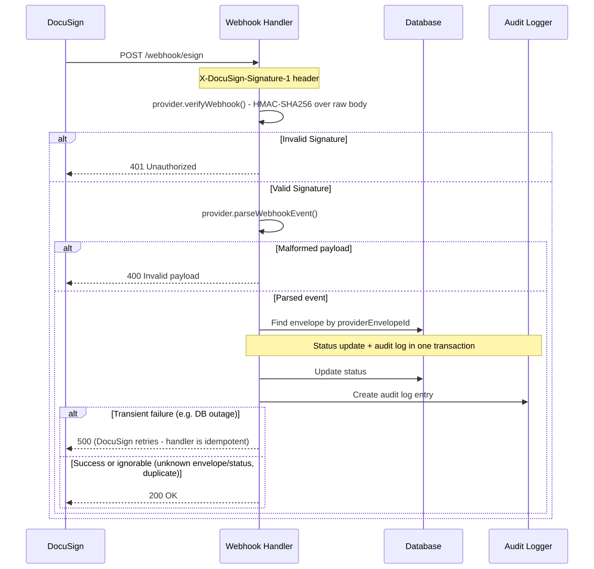
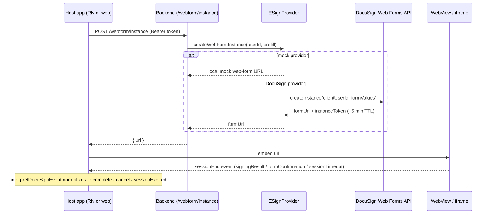

<!-- GENERATED FILE - do not edit. Sources: src/*.mmd; run `make diagrams`. -->

# Diagrams

Pre-rendered SVGs for instant loading; click a diagram to open its editable
Mermaid source in [src/](src/) (which renders natively on GitHub, in VS Code,
and in Obsidian). Regenerate with `make diagrams`.

---

## System Architecture

The public-URL mode needs no backend at all; Apollo/GraphQL is loaded only
by the proxy source (the `/webform` package entries never reach it).

---

## Data Flow Diagram (proxy mode)

---

## Signing Flow Process

---

## Database ERD

---

## Component Hierarchy

---

## Webhook Flow

---

## GraphQL Request Flow

---

## Web Forms Mode Flow

