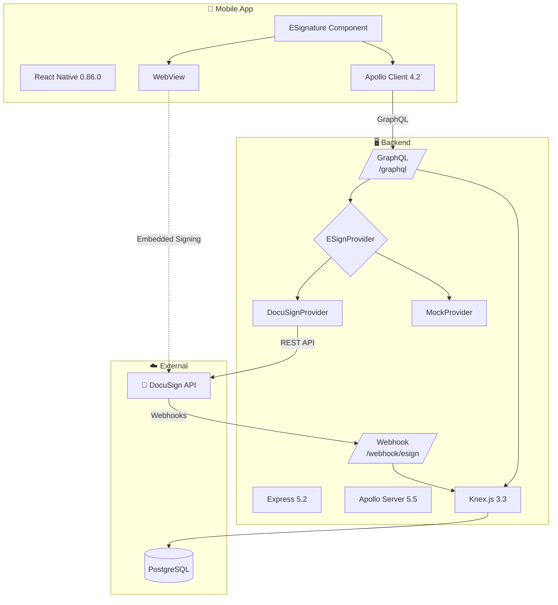
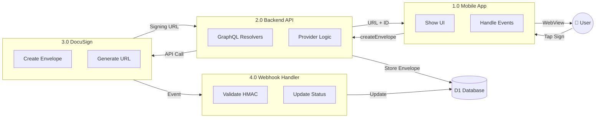
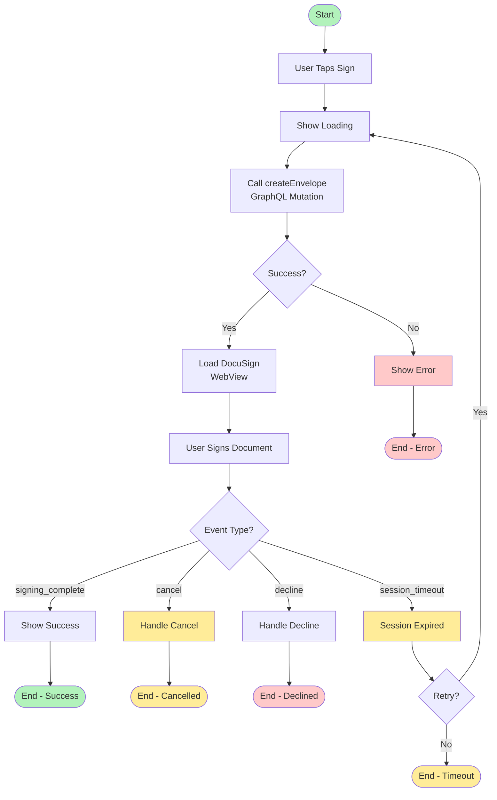
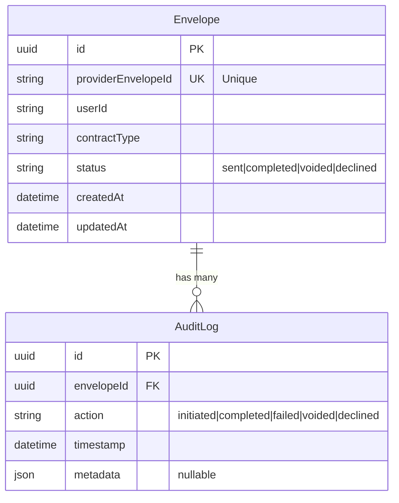
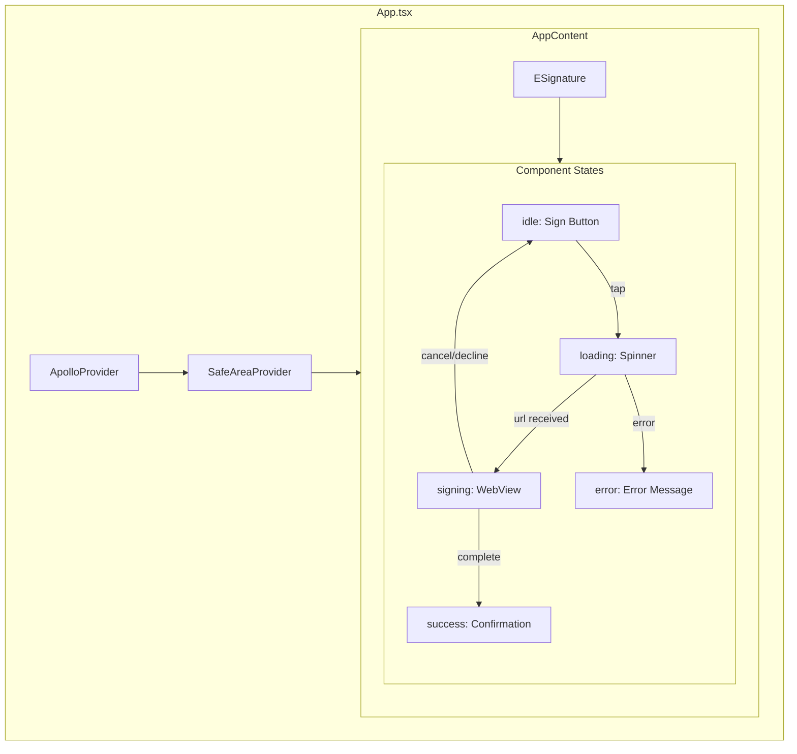
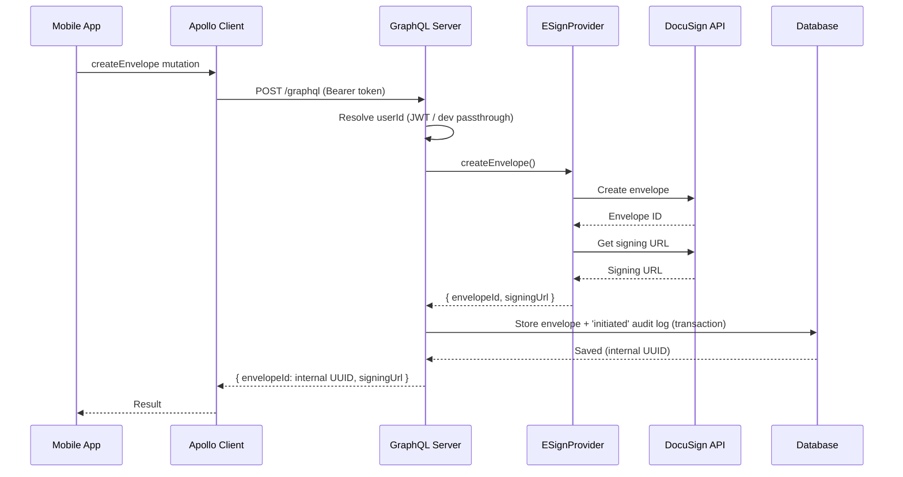

# Diagrams (Mermaid)

These diagrams render automatically in GitHub, GitLab, Obsidian, and VS Code.

---

## System Architecture



---

## Data Flow Diagram



---

## Signing Flow Process



---

## Database ERD



---

## Component Hierarchy



---

## Webhook Flow

```mermaid
sequenceDiagram
    participant DS as DocuSign
    participant WH as Webhook Handler
    participant DB as Database
    participant AL as Audit Logger

    DS->>WH: POST /webhook/esign
    Note over WH: X-DocuSign-Signature-1 header

    WH->>WH: provider.verifyWebhook() - HMAC-SHA256 over raw body

    alt Invalid Signature
        WH-->>DS: 401 Unauthorized
    else Valid Signature
        WH->>WH: provider.parseWebhookEvent()
        alt Malformed payload
            WH-->>DS: 400 Invalid payload
        else Parsed event
            WH->>DB: Find envelope by providerEnvelopeId
            Note over WH,AL: Status update + audit log in one transaction
            WH->>DB: Update status
            WH->>AL: Create audit log entry
            alt Transient failure (e.g. DB outage)
                WH-->>DS: 500 (DocuSign retries; handler is idempotent)
            else Success or ignorable (unknown envelope/status, duplicate)
                WH-->>DS: 200 OK
            end
        end
    end
```

---

## GraphQL Request Flow


