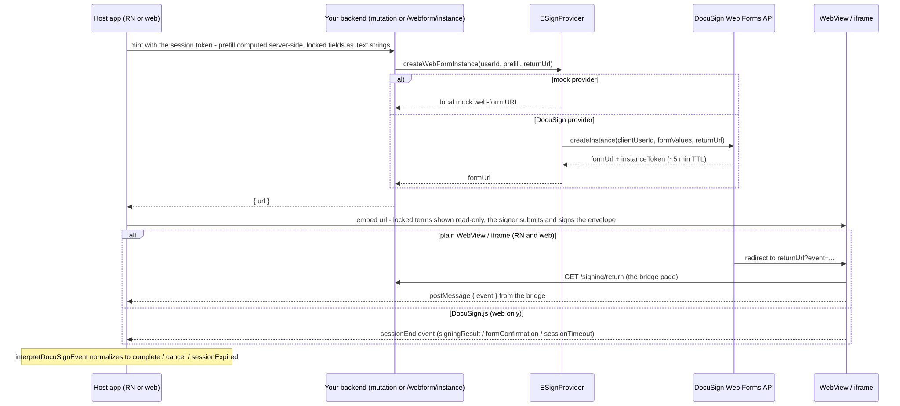

# DocuSign Web Forms Mode

**Updated:** 2026-09-09

The signing component supports three modes via its `SigningSource` (see the
package READMEs). This doc covers the **DocuSign Web Forms** mode: a prefilled,
form-based signing experience, minted by the backend and embedded in the client.

Two ways to run it:

- **Deterministic (CI):** `ESIGN_PROVIDER=mock` → the backend mints a local
  **mock web-form** instance (`/signing/mock-webform/:id`) that emits the *real*
  DocuSign event vocabulary. No credentials. This is what the E2E suites run.
- **Live:** `ESIGN_PROVIDER=docusign` + the DocuSign config below → the backend
  calls the real Web Forms `Instances:createInstance` API. Credentialed;
  not for public CI.

## How it flows

[](../diagrams/src/webforms-flow.mmd)

The embedded page reports back via postMessage
(`{ type: 'signingComplete' | 'signingCancel' | ... }`);
`interpretDocuSignEvent` maps those to `onComplete` / `onCancel` / ...

The backend endpoint is provider-agnostic (`POST /webform/instance`,
authenticated); the mode is chosen by `ESIGN_PROVIDER`. Nothing DocuSign-specific
lives outside the DocuSign adapter (`examples/full-service-demo/src/providers/docusign/`).

## Toggling the demos

| | Flag | Example |
|---|---|---|
| Web demo (Vite) | `VITE_ESIGN_MODE` | `VITE_ESIGN_MODE=webform npm run dev` |
| RN demo (Metro, bundle-time) | `ESIGN_MODE` | `ESIGN_MODE=webform npm start` |

Both default to `proxy`.

## Locking prefilled values (read-only fields)

A form typically mixes values the signer enters (country of residence) with
terms the sender has already fixed (number of units, amounts, an FX rate and
its timestamp). The fixed terms must not be editable in the form, or the
signed document can disagree with what the backend settles.

DocuSign's rules (verified against the Web Forms docs, 2026-09):

- A field marked **Read only** in the Web Forms builder can only be populated
  by a builder **default value** or by the `formValues` of an
  **`Instances:createInstance`** request. Prefill by URL (`#field=value`) and
  prefill through Docusign JS **cannot** populate read-only fields.
- A required read-only field left empty makes the submission fail
  ("Request sent is well formed but otherwise invalid").
- A field hidden by a rule is dropped from the submission - its value never
  reaches the document.

So the recipe is: mark the fixed fields Read only (keep Required) in the
builder - **as Text (or Dropdown) fields**: a read-only Number or Date
field makes DocuSign refuse the form's submission, see "Submitting a form
with read-only fields" below - and mint every instance server-side with
those values in the prefill. That mint is one call from `@blinkbitcoin/esign-server`, which any
Node backend can make (the values are usually computed there anyway):

```ts
import { createWebFormInstance, docuSignConfigFromEnv } from '@blinkbitcoin/esign-server';

const docusign = docuSignConfigFromEnv(); // once; DOCUSIGN_* env
const { url } = await createWebFormInstance({
  config: docusign,
  userId: session.userId,
  prefill: { number_of_units: '1000', settlement_amount_btc: '0.01268231', rate_timestamp: '2026-09-08 10:44' },
});
```

Hosts without a backend of their own run this repo's service instead, whose
`POST /webform/instance` is that same call behind an authenticated endpoint.
On the app side the source does the authenticated POST itself:

```tsx
const source = createWebFormsSource({
  mint: { url: 'https://api.example.com/webform/instance', getAuthToken }, // the app's session token
  prefill: { number_of_units: '1000', settlement_amount_btc: '0.01268231' },
});
<ESignature source={source} onComplete onCancel onError />
```

The instance also carries a `returnUrl` (the service's `/signing/return`
bridge by default), so a real form finishing in a plain WebView or iframe
reports its outcome through the same postMessage protocol as the mock -
no DocuSign.js needed on React Native. The request body is:

```json
{ "prefill": { "number_of_units": "1000", "total_subscription_usd": "1000",
               "settlement_amount_btc": "0.01268231", "rate_timestamp": "2026-09-08 10:44" } }
```

Keys are the fields' API reference names; the value shape follows the field
type (`examples/full-service-demo/src/types.ts`): text / email / date (`yyyy-mm-dd`) / dropdown /
radio → string, **Number → a JSON number** (unquoted, `.` decimal, no
thousands separators; for *editable* Number fields - locked amounts and
dates are Text fields, hence the strings above), checkbox group → string array, phone →
`{ countryCode?, nationalNumber }`. The endpoint validates that contract at the
edge (`examples/full-service-demo/src/webFormPrefill.ts`) and answers 400 with a reason for
anything else, before the provider is called. Mint the instance right before
opening it: the instance token expires about five minutes after creation.

### How we got here (2026-09-08)

The first host's test against a published form showed every computed
field editable. Two builder-side fixes were tried and both fail, for reasons
that are documented DocuSign behaviour, not bugs to work around:

| Tried | Result | Why |
|---|---|---|
| Mark the fields **Read only** in the builder, keep prefilling by URL | fields render disabled but **empty**; submit fails with "Request sent is well formed but otherwise invalid" | URL prefill cannot populate read-only fields, and the fields are required |
| **Hide** the fields with a rule | the values never reach the document | hidden fields are dropped from the submission |

Options considered:

1. Ship v1 with the fields editable - rejected: the signer could sign a
   document whose amounts, rate and timestamp differ from what the backend
   settles.
2. eSignature envelopes from a template with locked tabs - workable, but a
   different product surface (no form step, DocuSign.js not involved) and a
   second integration to maintain next to Web Forms.
3. **Web Forms `createInstance` with `formValues`** - chosen: it is the one
   documented way to populate read-only fields, the backend already exposed it
   (`POST /webform/instance`), and the host only has to build the prefill
   from the values it already computed.

Sources (DocuSign, read 2026-09-08):
[Prefill web form instance fields](https://developers.docusign.com/docs/web-forms-api/plan-integration/prefill-instance-fields/)
("If supplied in an Instances:createInstance request, prefill values can be
used to populate read-only fields. If supplied with Docusign JS, prefill values
cannot"),
[Populate Read-Only Fields on a Web Form](https://support.docusign.com/s/document-item?language=en_US&bundleId=gmi1660583110357&topicId=hty1709929728541.html)
("Their values must be set either through the API or by assigning a default
value"),
[Prefill a Web Form By URL](https://support.docusign.com/s/document-item?language=en_US&bundleId=gmi1660583110357&topicId=kup1721242003741.html),
[Web form instance URLs](https://developers.docusign.com/docs/web-forms-api/plan-integration/instance-urls/)
(instance token expires five minutes after generation).

The **mock web-form page** models both prefill channels so the guarantee is
testable without credentials: values minted with the instance render as
locked (`readonly`) inputs, values arriving in the URL (public-form style)
render editable. The browser E2E (`e2e/webform.spec.ts`, `e2e/publicurl.spec.ts`),
the Maestro webform flow and the backend E2E (`tests/e2e/webform.e2e.test.ts`)
assert exactly that.

## Running the E2E

```sh
# Web (deterministic, real cross-origin iframe, mock web-form page):
make e2e-web-webform

# Mobile (deterministic, real WebView):
#   backend + ESIGN_MODE=webform Metro + simulator, then:
#   maestro test examples/react-native-demo/.maestro/webform-happy-path.yaml \
#     -e APP_ID=org.reactjs.native.example.ReactNativeSandbox
```

Both exercise `createWebFormsSource` + `interpretDocuSignEvent` against a page
emitting the real DocuSign event names — so a green run proves the actual
protocol, not a lenient stand-in. The web suites pick their ports per git
worktree (`examples/react-demo/e2e/ports.ts`; `E2E_PORT_OFFSET=0` for the
canonical :4000 / :5174), so parallel sessions never collide.

## Live run against real DocuSign

The one-command version, once `.env` exists (`make docusign-env`, see
[docusign-proxy.md](docusign-proxy.md)); the same run in GitHub Actions is
[operations/live-e2e-ci.md](../operations/live-e2e-ci.md):

```sh
make docusign-check   # JWT grant + the form is reachable (names the consent URL otherwise)
make e2e-live         # service on DocuSign (LIVE_PORT, default 4010) → API live test → Playwright locked-fields check → stop
make e2e-ios-live     # the same journey in the React Native demo's WebView (booted simulator with the app installed, Maestro)
```

`make e2e-live` also runs the web demo against the live service in a real
browser twice - webform mode (the real form inside the component's
iframe, walked to its Summary with the locked terms, **submitted**, the
envelope DocuSign creates from it signed in the same iframe, Finish, the
return-URL bridge posting completion, the demo's success screen) and proxy
mode (an envelope from the template, DocuSign's signing ceremony inside
the iframe, a real signature adopted and applied, Finish, the bridge, the
success screen; the E2E Postgres holds the envelope) - and boots the
mint-only and serverless examples on the DocuSign provider to mint real
instances. `make e2e-ios-live` (`scripts/e2e/ios-live.sh`) repeats the
Web Form journey in the React Native demo: the service on DocuSign, a
Metro bundled with `ESIGN_MODE=webform`, `ESIGN_BACKEND_PORT` and the
fixture's `ESIGN_PREFILL`, and the Maestro flow `webform-live.yaml`
driving the real form in the WebView to a signed envelope (tagged `live`,
excluded from the default suites; the ceremony's Sign and Finish are
tapped by position, so it is pinned to the iPhone 16 Pro simulator). It mints with the
capability test form's group C values plus
every required editable field (the form refuses Next while one is empty, so
the walker could not reach the locked pages otherwise) and asserts the six
locked labels (`scripts/e2e/live.sh` holds the defaults;
`E2E_LIVE_PREFILL` / `E2E_LIVE_LOCKED_LABELS` override them). Verified
green against the real form on 2026-09-09: every minted value is displayed;
the walk then reopens the locked-terms page and tries to change each of
the eight group C fields the way a signer would (click, type, fill, pick),
and every one keeps its minted value (a locked dropdown keeps the select
enabled and disables its options); dates render as `yyyy/mm/dd`. Step by step:

1. Complete the DocuSign account + JWT setup in
   [docusign-proxy.md](docusign-proxy.md) (consent, keys, account/user IDs).
2. Build and **publish a Web Form** in the DocuSign Web Forms builder, mapped to
   a template; note its **form id** and the fields' **API reference names**
   (these are the `formValues`/prefill keys).
3. Configure the backend (`examples/full-service-demo/.env`):
   ```env
   ESIGN_PROVIDER=docusign
   DOCUSIGN_WEBFORM_ID=<form id>   # the capability test form v2 for the live suite
   DOCUSIGN_WEBFORMS_BASE_URL=https://apps-d.docusign.com/api/webforms/v1.1
   # + the standard DOCUSIGN_* JWT config (see docusign-proxy.md)
   ```
4. Verify the API contract without a UI: `make test-live` in `examples/full-service-demo` runs
   `tests/live/webforms.live.test.ts` — real JWT auth + a real
   `createInstance` call, asserting the response shape and that the minted
   URL is served. Skips itself when the `DOCUSIGN_*` env vars are unset, so
   it is safe to leave in place (it is excluded from `npm test` and CI).
   Set `DOCUSIGN_LIVE_PREFILL='{"number_of_units": 1000, ...}'` to also mint
   a typed-prefill instance for the configured form.
5. Verify the locked fields in a real browser: `make e2e-web-webform-live`
   runs `examples/react-demo/e2e/webform-live.spec.ts` against the real form
   (Playwright, no mock, no web servers started). It skips itself unless one
   of the first two variables is set:

   | Variable | Meaning |
   |---|---|
   | `E2E_LIVE_WEBFORM_URL` | An already-minted instance URL (`formUrl#instanceToken=...`, valid ~5 min) - opened as is |
   | `E2E_LIVE_API_ORIGIN` | Otherwise: a running backend (`ESIGN_PROVIDER=docusign`) the spec mints through |
   | `E2E_LIVE_AUTH_TOKEN` | Bearer for `POST /webform/instance` (default `e2e-live`, the dev passthrough userId) |
   | `E2E_LIVE_PREFILL` | JSON object of field API reference name → value to mint with |
   | `E2E_LIVE_LOCKED_LABELS` | JSON object of form label → expected value for the read-only fields |

   ```sh
   E2E_LIVE_API_ORIGIN=http://localhost:4000 \
   E2E_LIVE_PREFILL='{"number_of_units":"1000","settlement_amount_btc":"0.01268231"}' \
   E2E_LIVE_LOCKED_LABELS='{"Number of Units":"1000","Settlement Amount (BTC)":"0.01268231"}' \
   make e2e-web-webform-live
   ```

   It asserts every scalar prefill value is displayed, every labelled field
   shows the minted value and is read-only or disabled, and saves
   `examples/react-demo/test-results/webform-live.png`.
6. Run a demo in webform mode; it now embeds the real form.

## Submitting a form with read-only fields (verified 2026-09-09, demo env)

(The one-page digest of this and every other live finding is
[docusign-lessons.md](docusign-lessons.md).)

**Finding: a read-only Number or Date field makes DocuSign refuse the
form's submission; read-only Text and Dropdown fields submit and their
values land on the document.** So locked amounts and locked dates must be
Text fields (a dropdown works for a locked choice). That is also the
cleaner contract for money: the string the backend formats is exactly
what the signer sees and what the document carries, with no two-decimal
ceiling (Number fields take at most two decimals).

How it was found. The first capability test form (v1, four locked Number
fields among its eight read-only fields) walked fine and showed every
minted value, and then `Summary → Next` - which posts the form's values to
`…/forms/<slug>/actions/ESignAction_…` - got **422 `UNPROCESSABLE_ERROR`
"Request sent is well formed but otherwise invalid"**, the message the
first host team saw. The 422 body says nothing else; the form
player's telemetry only logs "Player form submission error". Rewriting
the multipart `formValues` in flight (Playwright `page.route()`) ruled the
values out: date sent back as ISO or omitted, numbers as numbers, the
dropdown label, the template tabs made optional, with or without
`returnUrl` - all 422; stripping the read-only values gives 400 "The
field is required". So the bisect moved to the builder, on copies (field
types are frozen once a form is active):

| Form (copy) | Read-only fields | Submission |
|---|---|---|
| Joinder Agreement (template-built, no read-only) | none | 200, envelope, signing URL |
| Subscription Agreement, every field API-prefilled | none | 200 |
| Joinder copy, `full_name` made read-only | 1 Text | **200**, envelope `e9302713…`, value on the document |
| Capability form copy, only `reference` + `rate_timestamp` read-only | 2 Text | **200**, envelope `f8d725a3…` |
| … plus the three amounts read-only | 2 Text + 3 Number | 422 |
| … everything editable | none | 200 |
| Capability form v1 | 2 Text, 4 Number, 1 Date, 1 Dropdown | 422 |
| Capability form v2 (amounts retyped as Text) | 6 Text, 1 Date, 1 Dropdown | 422 |
| **Capability form v2, the Date field made editable** | 6 Text, 1 Dropdown | **200**, envelope `a8df290d…` - the live suite's fixture |

DocuSign's own guide ("Populate Read-Only Fields on a Web Form", support
center) documents the approach - read-only values "must be set either
through the API or by assigning a default value" - and a community thread
("Issues with Read-Only Field", esignature-api-63/22268) describes the
same symptom, unresolved as of January 2025, so this is a documented
feature with one broken field type, not a misuse. When a submission is
refused, the response headers carry what DocuSign support looks a failure
up by (the live spec logs them as `[live-demo] submission trace: …`):

| Header | Value on 2026-09-09 12:01:42 UTC (v1 form, instance `a6cdef2e-27a0-4cd1-a70b-0ae082343eea`) |
|---|---|
| `x-docusign-tracetoken` | `8650d36b92bcc0a135bb24c609facf56` |
| `x-request-id` | `1a23d44f-e790-9f38-b2d8-d5dbc73484ea` |
| form / account | `1228ee55-ce36-4b87-8646-39c93d50ee69` / `9a18f197-c01b-4813-8f7c-040b4e3a245a` (demo) |

**Consequences for a host that needs locked terms:**

- Web Forms with locked terms work end to end **as long as every read-only
  field is a Text or Dropdown field**: `make e2e-live` submits the v2
  fixture inside the web component, signs the envelope DocuSign creates
  from it and completes through the bridge (verified 2026-09-09, demo env;
  the production environment is assumed to match).
- Never make a Number or Date field read-only. Format amounts and dates
  server-side as the string the signer should see, and prefill them as
  text (a locked date as `yyyy-mm-dd` text is what the document carries).
- The proxy flow (`createEnvelopeFromTemplate` with `locked` tab values)
  remains the alternative when the data-collection step lives in the app.
- Prefilling *editable* fields works everywhere; it is a suggestion, not
  a lock.

## The capability test form (live E2E fixture)

One generic Web Form in the DocuSign demo account, **"esign capability test
form v2 (text amounts)"** (form id `c640d957-a2d0-4e36-9975-5374afb02b54`,
a copy of the v1 form `1228ee55-ce36-4b87-8646-39c93d50ee69` built
2026-09-08 via "Convert PDF document" from the AcroForm PDF checked into
`docs/assets/esign-capability-test-form.pdf`, its template generated
alongside; v2 retypes the four locked amounts as Text and leaves the
Date field editable, 2026-09-09, because field types are frozen once a
form is active and a read-only Number or Date field breaks the
submission). It exercises every prefill shape the backend
accepts and every lock mode the component can meet, so a single live run
covers the whole surface. Rebuild it from this table if it is ever lost
(labels are what the signer sees, API reference names are the prefill
keys):

| Group | Label | API reference name | Type | Required | Read only | Live prefill |
|---|---|---|---|---|---|---|
| recipient | Name | `Signer_name` | Text (recipient name) | yes | no | `"Test User"` |
| recipient | Email Address | `Signer_email` | Email (recipient email) | yes | no | `"test@example.com"` |
| A signer-entered | Full Name | `full_name` | Text | yes | no | `"Test User"` |
| A signer-entered | Email Address | `email` | Email | yes | no | `"test@example.com"` |
| A signer-entered | Country of Residence | `country` | Text | yes | no | (none, signer types) |
| A signer-entered | Preferred Contact Method | `preferred_contact` | Checkbox group (option API values from the builder) | no | no | see below |
| B prefilled, editable | Newsletter Subscription | `newsletter` | Radio: `yes`, `no` | no | no | `"yes"` |
| C locked terms | Registration Reference | `reference` | Text | yes | **yes** | `"E2E-0001"` |
| C locked terms | Subscription Plan | `plan` | Dropdown: Seed, Series A | yes | **yes** | `"seed"` |
| C locked terms | Number of Units | `number_of_units` | Text (Number in v1 - see notes) | yes | **yes** | `"1000"` |
| C locked terms | Total Subscription (USD) | `total_subscription_usd` | Text (Number in v1) | yes | **yes** | `"1000"` |
| C locked terms | Settlement Amount (BTC) | `settlement_amount_btc` | Text (Number in v1) | yes | **yes** | `"0.01268231"` |
| C locked terms | BTC/USD Conversion Rate | `btc_usd_rate` | Text (Number in v1) | yes | **yes** | `"78850"` |
| C locked terms | Rate Timestamp | `rate_timestamp` | Text | yes | **yes** | `"2026-09-08 10:44"` |
| C locked terms | Settlement Date | `settlement_date` | Date (yyyy/mm/dd display) | yes | no (read-only in v1 - see notes) | `"2026-09-10"` |
| D optional | Phone Number | `phone` | Text | no | no | `"+1 555 123 4567"` |
| D optional | Additional Notes | `notes` | Text | no | no | (none) |

Notes from the build:

- **The locked amounts are Text fields, and the Date field is editable**
  (v2). A read-only Number or Date field makes DocuSign refuse the
  submission (previous section; the Date stays in the fixture, prefilled
  but editable, to keep the date shape covered), and Number
  fields accept at most 2 decimal places anyway (the form shows "Number
  can have at most 2 decimal places" and blocks Next; verified live
  2026-09-09 on v1: the Web Forms API *accepts* `0.00380467` for a locked
  Number field and the form renders it, then flags the field invalid and
  refuses Next - and because it is read-only the signer cannot fix it. The
  live spec reports such a field as "invalid (locked!)"). Field **types
  cannot be changed after the form has been activated** (the Field Type
  selector disappears), which is why v2 is a copy of v1 rather than an
  edit; copy the form again for any further type change.
- **Demo vs production prefill by URL.** On the demo environment the public
  form URL with `#field=value` DOES populate read-only fields, and DocuSign
  shows a toast on the form: "Note that read-only fields must be populated
  via API in a Production environment." So a demo-account public URL is a
  handy manual smoke test, but it does not reproduce production behaviour;
  only `createInstance` does.
- **The public form URL is protected by a CAPTCHA**, which does not load in a
  headless browser ("Unable to load CAPTCHA verification"), so Next never
  works and the public URL cannot be driven by Playwright. API-minted
  instances (`formUrl#instanceToken=…`) are what the live suite must open.

- The two **recipient** fields (`Signer_name`, `Signer_email`) are what the
  builder adds to feed the envelope's signer; they are mapped under
  Signature → Recipient Connections and must be prefilled (or typed) or the
  envelope cannot be created.
- The builder offers only Text / Email / Number / Date types for a
  **template-based** form, so the phone field is plain text here. The
  `{ countryCode, nationalNumber }` phone shape the backend accepts is for
  standalone forms and is covered by the unit tests only.
- Option API values of the checkbox group and dropdown are assigned by the
  builder and cannot be edited there; read them from
  `GET /v1.1/accounts/{accountId}/forms/{formId}` (`Configurations:getForm`)
  before prefilling `preferred_contact` / `plan`.
- Signature settings: "Initiate signing session from email" **off** (embedded
  signing), "Enable document field editing" **off** (the submitted values are
  final; the signer cannot re-open the locked terms on the document).
- Nothing is hidden by a rule (a hidden field never reaches the document).

What each group proves in the live run: A the signer can still enter values;
B a minted value can be shown yet remain editable; C every lockable value
shape (amounts as text, free text, dropdown) is locked by minting and the
form still submits, and the date shows why the date is not locked; D
optional fields are accepted without blocking submit.

```sh
# Local live run against the fixture (backend on :4000 with ESIGN_PROVIDER=docusign
# and DOCUSIGN_WEBFORM_ID=c640d957-a2d0-4e36-9975-5374afb02b54)
E2E_LIVE_API_ORIGIN=http://localhost:4000 \
E2E_LIVE_PREFILL='{"Signer_name":"Test User","Signer_email":"test@example.com","full_name":"Test User","email":"test@example.com","country":"Sweden","newsletter":"yes","reference":"E2E-0001","plan":"seed","number_of_units":"1000","total_subscription_usd":"1000","settlement_amount_btc":"0.01268231","btc_usd_rate":"78850","rate_timestamp":"2026-09-08 10:44","settlement_date":"2026-09-10"}' \
E2E_LIVE_LOCKED_LABELS='{"Registration Reference":"E2E-0001","Number of Units":"1000","Total Subscription (USD)":"1000","Settlement Amount (BTC)":"0.01268231","BTC/USD Conversion Rate":"78850","Rate Timestamp":"2026-09-08 10:44"}' \
make e2e-web-webform-live
```

The spec walks the form the way a signer does (Start, then Next page by
page), collecting every field's label, value and read-only state, so labels
can live on any page. A Date field displays in the format chosen in the
builder (`yyyy/mm/dd` here, so a locked-label expectation for a date
would read `"2026/09/10"` while the prefill is `"2026-09-10"`); dropdown
and checkbox values display as their option labels.

## Verified against DocuSign docs (2026-07, prefill rules 2026-09)

- **createInstance** — endpoint `…/webforms/v1.1/accounts/{id}/forms/{formId}/instances`,
  body `{ clientUserId (REQUIRED, ≤100 chars), formValues }`, response
  `{ formUrl, instanceToken }` (token ~5 min TTL). Implemented in
  `providers/docusign/client.ts`. ✓
- **Read-only fields** — populated only by a builder default or by
  `createInstance` `formValues`; prefill by URL / Docusign JS is ignored for
  them ("Prefill web form instance fields", "Populate Read-Only Fields on a
  Web Form"). Number fields take unquoted numbers, dates `yyyy-mm-dd`,
  checkbox groups string arrays, phone `{ countryCode, nationalNumber }`. ✓
- **Event model** — real DocuSign delivers a single **`sessionEnd`** event via
  DocuSign.js, with the outcome in a discriminator: `signingResult` /
  `formConfirmation` (done), `sessionTimeout` (timeout). `interpretDocuSignEvent`
  and the mock-webform page now use this real vocabulary. ✓

## Two web embedding options

Real DocuSign Web Forms are embedded via **DocuSign.js** (`bundle.js`), which
creates the iframe and dispatches `sessionEnd`. A plain `<iframe src>` does
**not** receive those events. So the web package offers two sources:

| Source | Embedding | Use for |
|--------|-----------|---------|
| `createWebFormsSource` | plain iframe + postMessage | the deterministic **mock** flow (our mock page posts the events); simple hosts |
| `createDocuSignWebFormsSource` | **DocuSign.js SDK mount** | **real** DocuSign Web Forms (loads `bundle.js`, needs an `integrationKey`) |

```tsx
// Real web Web Forms:
const source = createDocuSignWebFormsSource({
  createInstance: () => fetch('/webform/instance', { method: 'POST', ... }).then(r => r.json()),
  integrationKey: 'your-integration-key',
  environment: 'demo', // or 'production'
});
<ESignature source={source} onComplete onError onCancel />
```

## Remaining live-verification items

Actionable one-pass checklist (capture points + where to fix mismatches):
[docusign-proxy.md, section 5](docusign-proxy.md).

- **The exact DocuSign.js SDK surface** — `createDocuSignWebFormsSource` is
  written to the documented API (`loadDocuSign` → `signing({url})` → `.on('sessionEnd')`
  → `.mount()`) and its wiring is unit-tested with a fake SDK, but the precise
  method signatures are marked to confirm against a live account (the loader is
  `istanbul ignore`d). The `sessionEnd` discriminator **field name** (`type` vs
  `sessionEndType` vs `returnValue`) is handled defensively - the interpreter
  scans all three.
- **Mobile.** DocuSign.js has no React Native equivalent, but it is not
  needed: the instance's `returnUrl` and the backend's bridge page deliver
  completion into a plain WebView. Verified against the real form on the iOS
  simulator (`make e2e-ios-live`, 2026-09-09).
- **Entitlement.** Web Forms may require a specific account plan/feature even in
  the demo environment.
