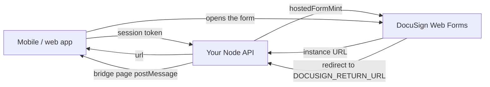
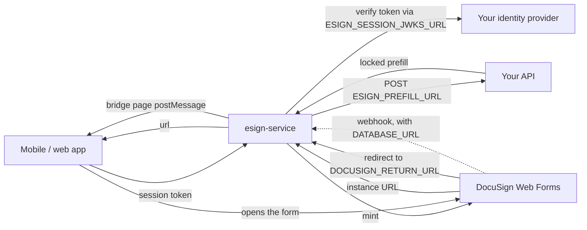

# Running the mint in production

For the people who take a working demo-account integration live: the
account owner, the backend developer, whoever operates the deployment, and
the mobile developer. Everything below is about the **mint** - a hosted
DocuSign Web Form whose terms the host sets and the signer cannot change -
and, where a deployment also runs envelopes, the service around it.

Two shapes, both supported, same environment contract:

- **Tier A - in-process.** The host's own Node API mints. Nothing extra is
  deployed; the recipe is [locked-prefill.md](../integration/locked-prefill.md)
  and the runnable example is
  [`examples/mint-only-demo`](../../examples/mint-only-demo/README.md).
- **Tier B - the service.** `@blinkbitcoin/esign-service` runs as a
  function or a container next to the host's API, which keeps the session
  and the terms. Its deploy targets are in
  [`packages/esign-service/README.md`](../../packages/esign-service/README.md#deploy).

> **Unverified against a production DocuSign account.** Every finding this
> repository documents comes from the developer (demo) environment; the
> production behaviour is assumed to match and stays unverified until a
> production account runs `make e2e-live`
> ([docusign-lessons.md](../integration/docusign-lessons.md), "Still
> open"). Treat the checklist at the end as the thing that closes it.

---

## 1. What runs where

### Tier A: the host's API mints in-process



The host API imports `@blinkbitcoin/esign-node` and gains three routes'
worth of behaviour inside its own process: the mint, the return-URL bridge
and a health endpoint. Nothing else is deployed, no database is involved,
and the DocuSign credentials never leave the API's own secret store.

### Tier B: the service is deployed



The service holds the DocuSign credentials; the host keeps the two things
only it knows - who the caller is (a JWKS endpoint or a shared HS256
secret) and what is being signed (`ESIGN_PREFILL_URL`). The mint is always on;
setting `DATABASE_URL` adds the envelope half (GraphQL API, provider
webhook, Postgres store).

### Pick a tier and a target

| Situation | Tier | Target |
|---|---|---|
| The host API is Node and can take a<br>dependency | A | its own deployment |
| The host API is not Node, or must not hold<br>DocuSign credentials | B | the [deploy table](../../packages/esign-service/README.md#deploy) |
| Envelope orchestration, webhooks or the<br>GraphQL API are wanted | B | a target with Postgres |
| Only a mint, on an edge runtime | B | Cloudflare (mint only) |
| The host is NixOS and the fleet is declared<br>in Nix | B | the [NixOS row](../../packages/esign-service/README.md#deploy),<br>template `packages/esign-service/deploy/nix/` |

Tier A and Tier B mint the same instance and are indistinguishable to the
app: the mobile side in section 5 is identical for both.

---

## 2. DocuSign go-live (account owner)

Going live is mostly DocuSign's process, not ours. Do not expect any of it
to be a code change here.

**DocuSign's steps** (in DocuSign's admin, in this order):

1. **Certify the integration on the demo key.** DocuSign reviews the API
   traffic the demo integration key produced before it will promote it
   (their "Go-Live" / API certification path). Run the flow on demo until
   it is accepted.
2. **Promote the integration key to production.** The result is an
   integration key usable in the production account.
3. **New GUIDs.** The production account has its own **API Account ID**,
   and the impersonated API user has its own **User ID**. The demo values
   are not valid in production - every `DOCUSIGN_*` GUID is replaced.
4. **Grant consent again**, once, as the impersonated production user, on
   the production OAuth host. Consent is per integration key *and* user,
   so promotion does not carry it over.
5. **Rebuild and activate the form in the production account.** A Web
   Form does not migrate: the production form has its own form id, and its
   field API reference names must match the prefill keys the backend
   sends. Activation **freezes field types** - to retype a field, copy the
   form and activate the copy.

**Our steps** (this repository's contract):

6. **Point the three host settings at production.** They default to the
   demo environment, so an unset variable is a demo host - which the boot
   banner reports as `provider  docusign - ... is a demo host`, and
   `ESIGN_STRICT=true` refuses to start over:

   | Variable | Production value |
   |---|---|
   | `DOCUSIGN_OAUTH_URL` | `https://account.docusign.com` |
   | `DOCUSIGN_WEBFORMS_BASE_URL` | `https://apps.docusign.com/api/webforms/v1.1` |
   | `DOCUSIGN_BASE_URL` | `<account base URI>/restapi` |

   The **account base URI** is per account (it names the region's pod,
   e.g. `https://na4.docusign.net`). Read it from the Apps and Keys page,
   or from `GET https://account.docusign.com/oauth/userinfo` with a valid
   token - `accounts[].base_uri` for the account being used. Append
   `/restapi`.

7. **The consent URL** carries the scopes the JWT grant asks for
   (`DOCUSIGN_SCOPES` in
   `packages/esign-node/src/providers/docusign/config.ts`; `consentUrl()`
   builds this string):

   ```
   https://account.docusign.com/oauth/auth?response_type=code&scope=signature%20impersonation%20webforms_read%20webforms_instance_read%20webforms_instance_write&client_id=<INTEGRATION_KEY>&redirect_uri=<REDIRECT_URI>
   ```

   A consent granted for `signature impersonation` alone fails every Web
   Forms call with `AUTHORIZATION_INSUFFICIENT_SCOPE`. The redirect URI
   must be registered on the integration key; it is never used at runtime.

8. **Keep the form rules.** They are the same in production and are not
   negotiable: every locked value is a **Text** field (a Dropdown for a
   choice) with Read only + Required - never a read-only Number or Date
   field - and nothing locked may be hidden by a rule. The full list, with
   the reasons, is [docusign-lessons.md](../integration/docusign-lessons.md)
   and [locked-prefill.md](../integration/locked-prefill.md) section 1.

9. **New keypair for production.** Generate it where the production secret
   store lives, upload the public half on the production integration key,
   and never move the private half through a developer machine.

---

## 3. Backend developer

### Tier A - the host API mints

Three names from `@blinkbitcoin/esign-node`, wired once at boot:

```ts
import { bearerToken, hostedFormMint, hostedFormProviderFromEnv } from '@blinkbitcoin/esign-node';
import { createHostedFormRouter } from '@blinkbitcoin/esign-node/express';

const provider = hostedFormProviderFromEnv(process.env); // checked at boot

app.use(createHostedFormRouter({
  provider,
  authenticate: req => yourAuth(bearerToken(req.headers.authorization)),
  prefill: ({ userId, prefill }) => yourTerms(userId, prefill),
}));
```

`createHostedFormApp` is the same surface with no framework - one Fetch
entry point for a route handler, a Worker or a plain Node server.

**The mutation alternative.** A host that already has a GraphQL API adds
one mutation instead of mounting a route: the mint without any HTTP
surface is `hostedFormMint(hostedFormProviderFromEnv(env))`, called from
the resolver once the resolver has authenticated the caller and computed
the terms from the host's own data.

```ts
// examples/mint-only-demo/src/mint.ts
export const createMint = (env = process.env) =>
  hostedFormMint(hostedFormProviderFromEnv(env))!;   // once, at startup

// examples/mint-only-demo/src/schema.ts (the resolver)
investSigningUrl: async (_parent, args, context) => {
  if (!context.userId) throw new Error('Unauthenticated');
  const prefill = prefillFromQuote(quoteFor(args.units));  // the host's terms
  return context.mint(context.userId, prefill);            // { url, instanceId }
},
```

`createWebFormInstance` (`@blinkbitcoin/esign-node/docusign`) is the same
call one level lower, for a host that wants the DocuSign config in hand
rather than the provider registry -
[locked-prefill.md](../integration/locked-prefill.md) section 2 spells that
spelling out. The whole runnable shape, including the return-URL bridge,
is [`examples/mint-only-demo`](../../examples/mint-only-demo/README.md)
(`src/mint.ts`, `src/schema.ts`).

Whichever spelling, the return-URL bridge route must exist:
`DOCUSIGN_RETURN_URL` points at it, and without it the form completes on
DocuSign's side and the app never hears about it.

What the host still owns, in every spelling:

- **The session.** `authenticate` returns the user id or `null`; the
  package never sees the token. `null` is `401`.
- **The terms.** The `prefill` hook receives the caller's *validated*
  prefill and returns the prefill actually minted, so a client value can
  never decide a read-only field. To refuse the request - the caller's own
  input is out of range, say - throw `Errors.validationError(message)`,
  which comes back as `400 { error: message }`
  (`Errors.unauthorized()` → `401`); anything else falls through to `502`.
- **The edge concerns**: CORS, security headers, rate limits. The worked
  policy is the service's own (`packages/esign-service/src/app.ts` and
  `src/server.ts`) - copy from it rather than inventing one.
- **Timing.** The minted URL carries an instance token that expires about
  **five minutes** after minting, so mint when the user opens the signing
  screen, never earlier.

### Tier B - the host API answers two callbacks

The host does not mint. It exposes, instead:

- a **JWKS endpoint** (`ESIGN_SESSION_JWKS_URL`) or a shared HS256 secret
  (`ESIGN_SESSION_SECRET`) so the service can turn the
  app's bearer token into a user id - the id DocuSign sees as
  `clientUserId`;
- a **terms endpoint** (`ESIGN_PREFILL_URL`): the service POSTs
  `{ userId, input }` with the caller's bearer token forwarded (plus
  `x-esign-prefill-secret` when `ESIGN_PREFILL_SECRET` is set) and the reply's
  `{ prefill }` wins over the client's values key by key. Under
  `ESIGN_MINT_MODE=envelope` the POST also carries the client's
  `recipient`, and the reply `{ prefill, recipient }` is minted whole: nothing
  of the client's reaches the document, and the `recipient` is required and
  is who signs; without `ESIGN_PREFILL_URL` the caller names the signer. A non-2xx, a
  timeout or a reply without a prefill object is a `502` to the app - it
  never falls back to minting what the client sent. Because that request
  carries the session token and the shared secret, **use `https`** unless the
  hop is private (loopback, `*.svc`, `*.svc.cluster.local`, `*.internal`).
  The service does not refuse a plaintext URL - it cannot tell a private
  network from a public one by its hostname, and guessing wrong either blocks
  a legitimate deployment or gives false assurance.

Rotation in both tiers is a restart: the DocuSign config is read once at
boot, so replacing the key material means rolling the deployment.

---

## 4. DevOps

### Tier B: deploy

Every target runs the same image or the same package, on the same
environment contract, with the same `/health`. The table of targets - the
image, Compose, Kubernetes, NixOS, Cloud Run/Fly/Render/Railway, Lambda,
Vercel, Cloudflare - and the exact command per row lives with the templates it
refers to:
[`packages/esign-service/README.md#deploy`](../../packages/esign-service/README.md#deploy).
The templates themselves are
[`packages/esign-service/deploy/`](../../packages/esign-service/deploy/)
and ship in the published tarball; their only inputs are environment
variables. `make deploy-check` validates them.

Two things the table decides for you:

- **Capabilities.** Every row serves the mint. Envelope orchestration
  needs `DATABASE_URL` and a runtime that can open a Postgres connection,
  so Cloudflare is mint-only - the boot guard refuses `DATABASE_URL`
  there and names the target to use instead.
- **The migrate step.** Only when envelopes are on, once per database (and
  after an upgrade that adds a migration): `node dist/node.js migrate` in
  the image, `npx esign-service migrate` from the package. The templates
  wrap it as Compose's `migrate` profile and the Kubernetes
  `esign-service-migrate` Job.

### The environment

`packages/esign-service/.env.example` is the authoritative list, with
comments. In production the ones that matter:

<!-- BEGIN GENERATED env operator - edit packages/esign-service/src/env/registry.ts -->
| Variable | Why | When | How to obtain |
|---|---|---|---|
| `DATABASE_URL` | Decides whether this deployment orchestrates envelopes at all. Unset,<br>the mint is the whole service and no Postgres connection is opened. | default: unset - the mint alone, on every target | Your Postgres connection string. Apply the schema once with: node<br>dist/node.js migrate |
| `ESIGN_MINT_MODE` | Which of the two mints this deployment answers with. They are different<br>products: a Web Form asks the signer questions first, an envelope puts<br>them straight into the documents. | default: 'webform' | — |
| `ESIGN_PROVIDER` | Which e-signature provider mints. The mock needs no credentials and<br>signs nothing that holds. | default: 'mock' - which the boot banner reports as a demo provider | — |
| `ESIGN_SESSION_JWKS_URL` | Verifies that a caller's bearer token really came from your login<br>provider. Without a session source the service cannot tell one user from<br>another: it takes the token as the user id. | default: unset - see ESIGN_SESSION_SECRET, then the note above | Your identity provider publishes it. Take jwks_uri from its discovery<br>document: curl -s https://<issuer>/.well-known/openid-configuration \|<br>jq -r .jwks_uri Auth0, Okta, Cognito, Keycloak and Firebase all have<br>one. If your own backend issues the tokens, use ESIGN_SESSION_SECRET<br>instead - it is an equal, not a fallback. Confirm it with: node<br>dist/node.js check-session "$TOKEN" |
| `ESIGN_SESSION_SECRET` | The same verification, for a backend that issues its own tokens and<br>signs them with a shared secret. | default: unset | The secret your own backend signs session tokens with - the same value,<br>not a new one. Prefer ESIGN_SESSION_JWKS_URL when you have an identity<br>provider: this service then holds no signing material and cannot mint<br>tokens even if it is compromised. |
| `ESIGN_SESSION_ISSUER` | Pins which issuer a token may come from. Without it any token your key<br>material verifies is accepted, whoever issued it. | default: unset - the issuer is not checked | The iss claim of a real token, copied exactly: echo "$TOKEN" \| cut -d.<br>-f2 \| base64 -d \| jq -r .iss Trailing slashes count. check-session<br>names both sides when they differ. |
| `ESIGN_SESSION_AUDIENCE` | Pins which audience a token was minted for, so a token issued for<br>another service of yours is not accepted here. | default: unset - the audience is not checked | The aud claim of a real token: echo "$TOKEN" \| cut -d. -f2 \| base64 -d<br>\| jq -r .aud |
| `ESIGN_SESSION_USER_CLAIM` | Which claim carries your user id. DocuSign sees this value as<br>clientUserId, so it is what ties a signature to a person. | default: 'sub' | Look at a real token and pick the claim holding your user id: echo<br>"$TOKEN" \| cut -d. -f2 \| base64 -d \| jq |
| `ESIGN_PREFILL_URL` | Decides who computes the values a signer cannot change. Unset, the<br>client's own prefill is minted as sent - which is fine for a fixed<br>consent form and wrong for anything whose fields carry the deal. | default: unset - the client's prefill is minted as sent | An endpoint on your own backend that you write. It receives { userId,<br>input }        (an envelope mint also sends recipient) and answers {<br>prefill: { ... } }     (and, for an envelope, an optional recipient)<br>Confirm it answers correctly with: node dist/node.js check-prefill |
| `ESIGN_PREFILL_SECRET` | Lets your prefill endpoint tell this service apart from anything else<br>that finds the URL. | default: unset - the header is not sent | Any high-entropy string you also configure on the receiving endpoint:<br>openssl rand -hex 32 |
| `ESIGN_PREFILL_TIMEOUT_MS` | Bounds how long a mint waits on your backend before answering 502. | default: 5000 | — |
| `ESIGN_STRICT` | Turns every line the boot banner reports as unverified into a refusal to<br>start. Off by default because what an unverified session or a<br>client-supplied prefill means depends on your architecture, which this<br>process cannot see. | default: unset - the service reports its posture and starts | — |
| `DOCUSIGN_INTEGRATION_KEY` | Identifies your application to DocuSign. Without the JWT-grant<br>credentials nothing can be minted. | ESIGN_PROVIDER=docusign | DocuSign Admin -> Apps and Keys. The full click path, including the<br>consent step that is easy to miss, is<br>docs/integration/docusign-proxy.md. The integration key is the GUID<br>shown on the app. |
| `DOCUSIGN_ACCOUNT_ID` | Which DocuSign account the envelopes and instances belong to. | ESIGN_PROVIDER=docusign | DocuSign Admin -> Account -> API and Keys: the "API Account ID" GUID,<br>not the account number. |
| `DOCUSIGN_USER_ID` | Whom the service impersonates. Envelopes are sent as this user. | ESIGN_PROVIDER=docusign | DocuSign Admin -> Users -> the service user -> "API Username" (a GUID).<br>That user must have granted consent once. |
| `DOCUSIGN_PRIVATE_KEY` | Proves the service is the integration key it claims to be. The only<br>DocuSign value that is a secret. | ESIGN_PROVIDER=docusign | Generate a keypair, upload the public half on the integration key:<br>openssl genrsa -out esign.pem 2048 && openssl rsa -in esign.pem -pubout<br>Paste the private PEM verbatim. DocuSign Admin -> Apps and Keys. The<br>full click path, including the consent step that is easy to miss, is<br>docs/integration/docusign-proxy.md. Alternatives:<br>DOCUSIGN_PRIVATE_KEY_BASE64 (every target), DOCUSIGN_PRIVATE_KEY_FILE (a<br>container secret mount). |
| `DOCUSIGN_PRIVATE_KEY_BASE64` | The same key where a multi-line environment value is awkward. | instead of DOCUSIGN_PRIVATE_KEY | base64 -i esign.pem |
| `DOCUSIGN_PRIVATE_KEY_FILE` | The same key from a mounted secret, so it never appears in the<br>environment. | instead of DOCUSIGN_PRIVATE_KEY | The path a secret is mounted at, e.g. /run/secrets/docusign.pem.<br>Container-only: a Worker has no filesystem. |
| `DOCUSIGN_WEBFORM_ID` | Which Web Form the mint creates an instance of. | the Web Form mint (ESIGN_MINT_MODE=webform) | DocuSign -> Web Forms -> the form -> its id in the URL. The form must be<br>active. |
| `DOCUSIGN_TEMPLATE_ID` | Which template(s) an envelope is created from. | ESIGN_MINT_MODE=envelope, or envelope orchestration | DocuSign -> Templates -> the template -> its id. `make<br>docusign-template` creates the fixture one and prints its id. |
| `DOCUSIGN_RETURN_URL` | Where DocuSign sends the signer afterwards. It must reach this service's<br>bridge, which is what reports completion back to your app. | ESIGN_PROVIDER=docusign | This deployment's public URL plus /signing/return. It has to be<br>reachable by the signer's browser, not just by the service. |
| `DOCUSIGN_SIGNER_ROLE` | Which template role the signer fills. | default: 'signer' | The role name on the template, as spelled there. |
| `DOCUSIGN_HMAC_KEY` | Proves an inbound webhook really came from DocuSign. Without it anyone<br>who finds the URL can write 'completed' into your envelope records. | default: unset - the banner reports an unverified webhook | DocuSign Admin -> Connect -> your configuration -> Add HMAC key.<br>DocuSign shows the secret once. |
| `DOCUSIGN_BASE_URL` | Which DocuSign environment this is. The default is the demo one, which<br>signs nothing that holds up. | default: the demo host - reported as a sandbox by the boot banner | DocuSign Admin -> API and Keys shows your account's base URI, e.g.<br>https://na4.docusign.net/restapi The region prefix differs per account. |
| `DOCUSIGN_OAUTH_URL` | Where the JWT grant is exchanged. It has to match the environment of the<br>account. | default: the demo host | https://account.docusign.com for production; the default is the demo<br>host. |
| `DOCUSIGN_WEBFORMS_BASE_URL` | Where Web Forms instances are minted. Same environment rule again. | default: the demo host | https://apps.docusign.com/api/webforms/v1.1 for production; the default<br>is the demo host. |
| `PORT` | Which port the Node target listens on. A function target is told by its<br>platform. | default: ESIGN_PORT_BASE (4100) | — |
| `ESIGN_TRUST_PROXY` | Whether x-forwarded-for may be believed. It is a caller-controlled<br>header, so believing it without a proxy in front lets anyone spoof their<br>address past the rate limits. | default: unset - x-forwarded-for is ignored | Set it to true only when something you control terminates connections in<br>front of this service. |
| `ESIGN_CORS_ALLOWED_ORIGINS` | Which browser origins may call the mint and the GraphQL API. | default: unset - same-origin only | The origins of your own web app, e.g. https://app.example.com. |
| `ESIGN_RATE_LIMIT_WEBFORM_PER_MIN` | Caps mints per client per minute. Each one costs a real DocuSign<br>instance. | default: 60 | — |
| `ESIGN_RATE_LIMIT_ENVELOPE_PER_MIN` | The same cap for the envelope mint. | default: 60 | — |
| `ESIGN_RATE_LIMIT_WEBHOOK_PER_MIN` | Caps inbound webhooks, which arrive unauthenticated until the signature<br>is checked. | default: 120 | — |
| `ESIGN_RATE_LIMIT_GRAPHQL_PER_MIN` | Caps GraphQL requests per client. | default: 100 | — |
| `OTEL_EXPORTER_OTLP_ENDPOINT` | Turns tracing on. Off unless set, so no deployment ships spans it did<br>not ask for. | default: unset - tracing off | Your collector's OTLP endpoint, e.g. http://localhost:4318. Any OTLP<br>backend works. |
| `OTEL_SERVICE_NAME` | What this service is called in traces. | default: 'esign-service' | — |
<!-- END GENERATED -->

**Tier A** takes the same table **minus everything only the service
reads**: `ESIGN_SESSION_*`, `ESIGN_PREFILL_*`, `ESIGN_STRICT`,
`ESIGN_MINT_MODE` (the host picks `createHostedFormRouter` or
`createEnvelopeRouter` itself), `DATABASE_URL`, `DOCUSIGN_HMAC_KEY`,
`ESIGN_CORS_ALLOWED_ORIGINS`, `OTEL_*` and the container-only rows. The host
API already has a session, computes its own terms in the `prefill` hook, and
brings its own CORS, telemetry, port, proxy and limits. What is left is
`ESIGN_PROVIDER` and the `DOCUSIGN_*` settings, applied to the host API's own
deployment.

### The private key, per platform

The PEM has three sources, tried in this order:
`DOCUSIGN_PRIVATE_KEY`, `DOCUSIGN_PRIVATE_KEY_BASE64`,
`DOCUSIGN_PRIVATE_KEY_FILE` (literal `\n` is normalised in all three).

| Platform | Use | How |
|---|---|---|
| Docker / Compose | `DOCUSIGN_PRIVATE_KEY_FILE` | a Compose secret mounted read-only, e.g.<br>`/run/secrets/docusign_pem` |
| Kubernetes | `DOCUSIGN_PRIVATE_KEY_FILE` | its own Secret,<br>`deploy/k8s/secret-docusign-pem.yaml`,<br>mounted at `/run/secrets/docusign.pem` |
| NixOS | `DOCUSIGN_PRIVATE_KEY_FILE` | a secret from agenix / sops-nix, or a<br>root-owned file, mounted read-only into<br>the container by `deploy/nix/` |
| Vercel, Cloudflare,<br>other PaaS | `DOCUSIGN_PRIVATE_KEY_BASE64` | one-line env value; there is no file to<br>mount, and `_FILE` is refused on edge |
| Anything with<br>multi-line secrets | `DOCUSIGN_PRIVATE_KEY` | the PEM verbatim |

### What refuses to start, and what is only reported

`validateConfig` runs from the environment alone and lists **every** problem
at once, with the capabilities that were on, then refuses to start - a
container fails to boot, a function fails at first import. It refuses what it
can know is broken:

- an unknown `ESIGN_PROVIDER`, or a provider missing what a mint needs
  (`DOCUSIGN_WEBFORM_ID` and `DOCUSIGN_RETURN_URL`; under
  `ESIGN_MINT_MODE=envelope`, `DOCUSIGN_TEMPLATE_ID` - with at least one
  id - and `DOCUSIGN_RETURN_URL` instead);
- an `ESIGN_MINT_MODE` other than `webform` or `envelope` (unset or blank
  is `webform`);
- an `ESIGN_PREFILL_URL` that is not an absolute http(s) URL - one it could
  not POST to at all;
- `DATABASE_URL` on the Cloudflare runtime.

Everything else about a deployment's posture is **reported, not refused**,
because it depends on things this process cannot see - what sits in front of
the service, and whether the template's fields carry the deal:

```
  capabilities  mint, envelopes
  mint mode     webform
  provider      docusign
  session       verified (ESIGN_SESSION_JWKS_URL)
  prefill       from ESIGN_PREFILL_URL
  webhook       verified (DOCUSIGN_HMAC_KEY)
```

The Node target then probes the URLs it was given before it listens and adds
what it found - how many keys the key set offers, or why it could not be
read. A typo'd host is a line here instead of a 401 on every request.

**A production deployment should set `ESIGN_STRICT=true`.** It turns every
line the banner would report as unverified into a refusal to start, naming
the variable that fixes it, and makes a failed probe a refusal to listen.
That is the whole of the old fail-closed posture behind one variable:

```
Refusing to start (capabilities: mint): ESIGN_STRICT=true: session is not
verified - the bearer token is the user id - set ESIGN_SESSION_JWKS_URL or
ESIGN_SESSION_SECRET; ESIGN_STRICT=true: prefill is client-supplied
(ESIGN_PREFILL_URL unset) - set ESIGN_PREFILL_URL so your backend computes
the field values
```

GraphQL introspection is off unless `ESIGN_GRAPHQL_INTROSPECTION=true`, so a
deployment with envelopes on does not publish its schema by accident.

### Confirming the configuration

Two commands answer "did I get this right" without a deploy. Both exit
non-zero on the first thing wrong, so CI can use them too:

```bash
node dist/node.js check-session "$TOKEN"   # a real token, line by line
node dist/node.js check-prefill            # POSTs a sample to your callback
```

```
  ✓ source     hs256
  ✓ token      HS256, kid abc123
  ✓ signature  verified
  ✓ expiry     expires in 60m
  ✗ issuer     token says "https://id.example.com/", configured "https://id.example.com"
  ✓ audience   not enforced (ESIGN_SESSION_AUDIENCE unset)
  ✓ user id    sub = user_8812
```

They do not short-circuit: `jwtVerify` stops at the first failure, so one
deploy used to teach you about one problem. Every line is checked
independently, and the signature line means the signature alone - a wrong
issuer does not report as a signature failure.

| Symptom | Usually |
|---|---|
| every request 401s, banner says<br>`session verified` | the issuer or audience - run `check-session`<br>with a real token; a trailing slash on `iss`<br>is the common one |
| every mint 502s | the prefill callback - run `check-prefill` |
| banner says<br>`! <host> unreachable` | the URL resolves from your machine but not<br>from the container's network |
| webhooks arrive but change nothing | `DOCUSIGN_HMAC_KEY` does not match the one<br>in DocuSign Admin -> Connect |

`NODE_ENV` gates none of this: every Node image sets it, so it says
nothing about the e-signature configuration.

### Health and shutdown

- `GET /health` answers `{ status, capabilities, mint, timestamp }`, so a
  deployment says which capabilities it is serving and which mint
  (`webform` or `envelope`) answers. It is the readiness
  and liveness probe in the Kubernetes template and the image's
  `HEALTHCHECK`.
- **SIGTERM** stops the listener and drains in-flight requests before
  exiting, so a rolling deploy loses nothing. Give the orchestrator a
  grace period longer than the slowest mint.
- A minted URL carries a five-minute instance token, so it is a
  credential: the service does not log one, and anything that captures
  the service's output (a log shipper, a CI artifact) should be treated
  as carrying one anyway - which is why
  [live-e2e-ci.md](live-e2e-ci.md) does not upload the service log.

---

## 5. Mobile developer

Nothing about production changes on the app side. Install the package and
its two WebView peers:

```sh
npm i @blinkbitcoin/esign-react-native react-native-webview @react-native-community/netinfo
```

Point the source at the mint endpoint - the host API in Tier A, the
service in Tier B - and render the component:

```tsx
import { ESignature, createWebFormsSource } from '@blinkbitcoin/esign-react-native/webform';

const source = createWebFormsSource({
  mint: {
    url: 'https://esign.example.com/webform/instance',
    getAuthToken: () => session.accessToken,   // the app's own session token
  },
  prefill: { number_of_units: String(units) }, // intent; the host decides the terms
});

<ESignature
  source={source}
  onComplete={({ envelopeId }) => {}}
  onError={({ code, message }) => {}}
  onCancel={() => {}}
/>
```

That is the whole app surface. `allowedOrigin` is a **web-only** option
(React Native ignores it); for *this* source - a mint whose completion
arrives through the return-URL bridge - it is the bridge page's origin,
the backend's, not DocuSign's. (`createPublicUrlSource`, the published
form link, is the case where DocuSign's own origin is the right value.)

A deployment under `ESIGN_MINT_MODE=envelope` has no `/webform/instance`:
`POST /envelope/instance` takes `{ recipient: { name, email }, prefill }`
and answers `{ url, envelopeId }`, so the app mints with its own call - one
that sends the signer, unless the host's `ESIGN_PREFILL_URL` names it - and opens
the `url` as it opens a minted instance.

Web is the same code from `@blinkbitcoin/esign-react/docusign` - the web
package exports `.` and `./docusign`, there is no `./webform` subpath
there. Error codes: [error-codes.md](../integration/error-codes.md).

---

## 6. Verification checklist

Nothing here is confirmed until these pass against the **production**
account, form and hosts.

- [ ] `make e2e-live` with the production `DOCUSIGN_*` values in
      `packages/esign-service/.env` (or the environment): the JWT grant,
      a real minted instance with locked values, a browser walking the
      form and failing to tamper with a locked field, submission,
      signature and the bridge round-trip.
- [ ] `make e2e-ios-live` for the React Native journey, on a booted
      simulator with the demo installed (local only, not in CI).
- [ ] `curl` the mint with a **real session token** and confirm a `200`
      with an instance URL:

      ```sh
      curl -s https://esign.example.com/webform/instance \
        -H "authorization: Bearer $TOKEN" -H 'content-type: application/json' \
        -d '{"prefill":{"number_of_units":"10"}}'
      ```

      An expired or wrong-issuer token must answer `401`.
- [ ] The **terms callback** actually decided the values: the minted form
      shows what `ESIGN_PREFILL_URL` returned, not what the curl sent.
- [ ] The **bridge round-trip**: finishing the form redirects to
      `DOCUSIGN_RETURN_URL` and the app's `onComplete` fires with an
      `envelopeId`.
- [ ] The **guard refuses demo values**: boot the same deployment with a
      demo host or `ESIGN_PROVIDER=mock` and confirm it refuses to start,
      naming the offending setting.
- [ ] `GET /health` reports the capabilities the deployment is meant to
      serve (and only those), and the `mint` it is meant to answer with.
- [ ] With envelopes on: the migrate step ran, and a signed envelope
      reaches the webhook and is persisted.

When the first item passes, update
[docusign-lessons.md](../integration/docusign-lessons.md) "Still open" -
it is the record of what remains unverified.

---

## 7. Failure modes

| Symptom | Meaning | Fix |
|---|---|---|
| `consent_required` on the grant | this integration key + user never<br>granted consent in this account | the consent URL in section 2,<br>as the impersonated user |
| `AUTHORIZATION_INSUFFICIENT_SCOPE` | consent granted without the<br>`webforms_*` scopes | re-grant with the full scope<br>string from section 2 |
| The mint fails on the form | the production form is not active,<br>or its id is a demo id | activate it; set the production<br>`DOCUSIGN_WEBFORM_ID` |
| `401` from the mint | the host rejected the token: wrong<br>issuer, audience, claim or expiry | check `SESSION_*` against the<br>token the app actually sends |
| `502 Could not compute the signing<br>terms` | `ESIGN_PREFILL_URL` timed out, answered<br>non-2xx, or without a prefill<br>(envelope mint: an out-of-contract<br>prefill or a malformed recipient) | fix the host endpoint; raise<br>`ESIGN_PREFILL_TIMEOUT_MS` if it is slow |
| `502 Could not create signing session` | DocuSign refused the mint (config,<br>consent, form) | the service log names the error<br>code; check the rows above |
| The bridge never fires | `DOCUSIGN_RETURN_URL` is not the<br>deployed bridge route, or is<br>unreachable from the signer | point it at the deployment's<br>`/signing/return` |
| Refuses to boot naming a demo host | `ESIGN_ENV=production` with a<br>sandbox host or the mock provider | set the production hosts<br>(section 2) |
| Submission refused (422) | a read-only field is a Number or<br>Date field | retype it on a **copy** of the<br>form: types freeze on activation |

More detail per layer:
[error-codes.md](../integration/error-codes.md) (app-facing codes),
[docusign-lessons.md](../integration/docusign-lessons.md) (the DocuSign
rules behind them), [live-e2e-ci.md](live-e2e-ci.md) (the same failures as
seen from CI).
