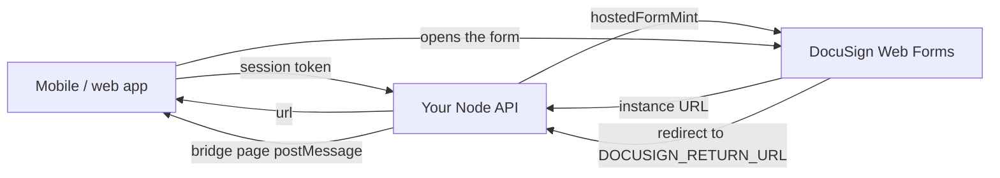
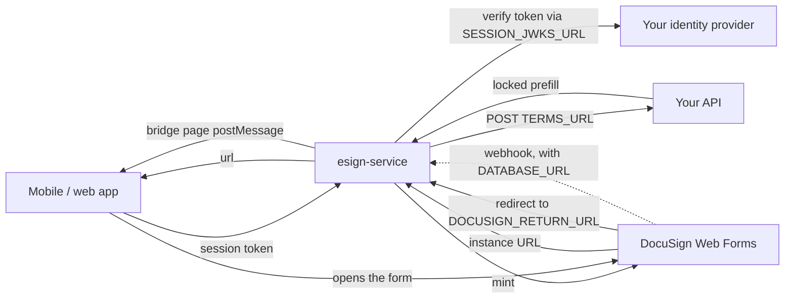

# Running the mint in production

For the people who take a working demo-account integration live: the
account owner, the backend developer, whoever operates the deployment, and
the mobile developer. Everything below is about the **mint** - a hosted
DocuSign Web Form whose terms the host sets and the signer cannot change -
and, where a deployment also runs envelopes, the service around it.

Two shapes, both supported, same environment contract:

- **Tier A - in-process.** The host's own Node API mints. Nothing extra is
  deployed; the recipe is [locked-terms.md](../integration/locked-terms.md)
  and the runnable example is
  [`examples/mint-only-demo`](../../examples/mint-only-demo/README.md).
- **Tier B - the service.** `@blinkbitcoin/esign-service` runs as a
  function or a container next to the host's API, which keeps the session
  and the terms. Its deploy targets are in
  [`packages/esign-service/README.md`](../../packages/esign-service/README.md#deploy).

> **Unverified against a production DocuSign account.** Every finding this
> repository documents comes from the developer (demo) environment; the
> production behaviour is assumed to match and stays unverified until a
> production account runs `make e2e-live`
> ([docusign-lessons.md](../integration/docusign-lessons.md), "Still
> open"). Treat the checklist at the end as the thing that closes it.

---

## 1. What runs where

### Tier A: the host's API mints in-process



The host API imports `@blinkbitcoin/esign-node` and gains three routes'
worth of behaviour inside its own process: the mint, the return-URL bridge
and a health endpoint. Nothing else is deployed, no database is involved,
and the DocuSign credentials never leave the API's own secret store.

### Tier B: the service is deployed



The service holds the DocuSign credentials; the host keeps the two things
only it knows - who the caller is (a JWKS endpoint or a shared HS256
secret) and what is being signed (`TERMS_URL`). The mint is always on;
setting `DATABASE_URL` adds the envelope half (GraphQL API, provider
webhook, Postgres store).

### Pick a tier and a target

| Situation | Tier | Target |
|---|---|---|
| The host API is Node and can take a<br>dependency | A | its own deployment |
| The host API is not Node, or must not hold<br>DocuSign credentials | B | the [deploy table](../../packages/esign-service/README.md#deploy) |
| Envelope orchestration, webhooks or the<br>GraphQL API are wanted | B | a target with Postgres |
| Only a mint, on an edge runtime | B | Cloudflare (mint only) |

Tier A and Tier B mint the same instance and are indistinguishable to the
app: the mobile side in section 5 is identical for both.

---

## 2. DocuSign go-live (account owner)

Going live is mostly DocuSign's process, not ours. Do not expect any of it
to be a code change here.

**DocuSign's steps** (in DocuSign's admin, in this order):

1. **Certify the integration on the demo key.** DocuSign reviews the API
   traffic the demo integration key produced before it will promote it
   (their "Go-Live" / API certification path). Run the flow on demo until
   it is accepted.
2. **Promote the integration key to production.** The result is an
   integration key usable in the production account.
3. **New GUIDs.** The production account has its own **API Account ID**,
   and the impersonated API user has its own **User ID**. The demo values
   are not valid in production - every `DOCUSIGN_*` GUID is replaced.
4. **Grant consent again**, once, as the impersonated production user, on
   the production OAuth host. Consent is per integration key *and* user,
   so promotion does not carry it over.
5. **Rebuild and activate the form in the production account.** A Web
   Form does not migrate: the production form has its own form id, and its
   field API reference names must match the prefill keys the backend
   sends. Activation **freezes field types** - to retype a field, copy the
   form and activate the copy.

**Our steps** (this repository's contract):

6. **Point the three host settings at production.** They default to the
   demo environment, so an unset variable is a demo host and the boot
   guard refuses it under `ESIGN_ENV=production`:

   | Variable | Production value |
   |---|---|
   | `DOCUSIGN_OAUTH_URL` | `https://account.docusign.com` |
   | `DOCUSIGN_WEBFORMS_BASE_URL` | `https://apps.docusign.com/api/webforms/v1.1` |
   | `DOCUSIGN_BASE_URL` | `<account base URI>/restapi` |

   The **account base URI** is per account (it names the region's pod,
   e.g. `https://na4.docusign.net`). Read it from the Apps and Keys page,
   or from `GET https://account.docusign.com/oauth/userinfo` with a valid
   token - `accounts[].base_uri` for the account being used. Append
   `/restapi`.

7. **The consent URL** carries the scopes the JWT grant asks for
   (`DOCUSIGN_SCOPES` in
   `packages/esign-node/src/providers/docusign/config.ts`; `consentUrl()`
   builds this string):

   ```
   https://account.docusign.com/oauth/auth?response_type=code&scope=signature%20impersonation%20webforms_read%20webforms_instance_read%20webforms_instance_write&client_id=<INTEGRATION_KEY>&redirect_uri=<REDIRECT_URI>
   ```

   A consent granted for `signature impersonation` alone fails every Web
   Forms call with `AUTHORIZATION_INSUFFICIENT_SCOPE`. The redirect URI
   must be registered on the integration key; it is never used at runtime.

8. **Keep the form rules.** They are the same in production and are not
   negotiable: every locked value is a **Text** field (a Dropdown for a
   choice) with Read only + Required - never a read-only Number or Date
   field - and nothing locked may be hidden by a rule. The full list, with
   the reasons, is [docusign-lessons.md](../integration/docusign-lessons.md)
   and [locked-terms.md](../integration/locked-terms.md) section 1.

9. **New keypair for production.** Generate it where the production secret
   store lives, upload the public half on the production integration key,
   and never move the private half through a developer machine.

---

## 3. Backend developer

### Tier A - the host API mints

Three names from `@blinkbitcoin/esign-node`, wired once at boot:

```ts
import { bearerToken, hostedFormMint, hostedFormProviderFromEnv } from '@blinkbitcoin/esign-node';
import { createHostedFormRouter } from '@blinkbitcoin/esign-node/express';

const provider = hostedFormProviderFromEnv(process.env); // checked at boot

app.use(createHostedFormRouter({
  provider,
  authenticate: req => yourAuth(bearerToken(req.headers.authorization)),
  prefill: ({ userId, prefill }) => yourTerms(userId, prefill),
}));
```

`createHostedFormApp` is the same surface with no framework - one Fetch
entry point for a route handler, a Worker or a plain Node server.

**The mutation alternative.** A host that already has a GraphQL API adds
one mutation instead of mounting a route: the mint without any HTTP
surface is `hostedFormMint(hostedFormProviderFromEnv(env))`, called from
the resolver once the resolver has authenticated the caller and computed
the terms from the host's own data.

```ts
// examples/mint-only-demo/src/mint.ts
export const createMint = (env = process.env) =>
  hostedFormMint(hostedFormProviderFromEnv(env))!;   // once, at startup

// examples/mint-only-demo/src/schema.ts (the resolver)
investSigningUrl: async (_parent, args, context) => {
  if (!context.userId) throw new Error('Unauthenticated');
  const prefill = prefillFromQuote(quoteFor(args.units));  // the host's terms
  return context.mint(context.userId, prefill);            // { url, instanceId }
},
```

`createWebFormInstance` (`@blinkbitcoin/esign-node/docusign`) is the same
call one level lower, for a host that wants the DocuSign config in hand
rather than the provider registry -
[locked-terms.md](../integration/locked-terms.md) section 2 spells that
spelling out. The whole runnable shape, including the return-URL bridge,
is [`examples/mint-only-demo`](../../examples/mint-only-demo/README.md)
(`src/mint.ts`, `src/schema.ts`).

Whichever spelling, the return-URL bridge route must exist:
`DOCUSIGN_RETURN_URL` points at it, and without it the form completes on
DocuSign's side and the app never hears about it.

What the host still owns, in every spelling:

- **The session.** `authenticate` returns the user id or `null`; the
  package never sees the token. `null` is `401`.
- **The terms.** The `prefill` hook receives the caller's *validated*
  prefill and returns the prefill actually minted, so a client value can
  never decide a read-only field. To refuse the request - the caller's own
  input is out of range, say - throw `Errors.validationError(message)`,
  which comes back as `400 { error: message }`
  (`Errors.unauthorized()` → `401`); anything else falls through to `502`.
- **The edge concerns**: CORS, security headers, rate limits. The worked
  policy is the service's own (`packages/esign-service/src/app.ts` and
  `src/server.ts`) - copy from it rather than inventing one.
- **Timing.** The minted URL carries an instance token that expires about
  **five minutes** after minting, so mint when the user opens the signing
  screen, never earlier.

### Tier B - the host API answers two callbacks

The host does not mint. It exposes, instead:

- a **JWKS endpoint** (`SESSION_JWKS_URL`) or a shared HS256 secret
  (`SESSION_HS256_SECRET`, alias `JWT_SECRET`) so the service can turn the
  app's bearer token into a user id - the id DocuSign sees as
  `clientUserId`;
- a **terms endpoint** (`TERMS_URL`): the service POSTs
  `{ userId, input }` with the caller's bearer token forwarded (plus
  `x-esign-terms-secret` when `TERMS_SHARED_SECRET` is set) and the reply's
  `{ prefill }` wins over the client's values key by key. A non-2xx, a
  timeout or a reply without a prefill object is a `502` to the app - it
  never falls back to minting what the client sent. Because that request
  carries the session token and the shared secret, production requires
  `https` unless the host is private (loopback, `*.svc`,
  `*.svc.cluster.local`, `*.internal`) or `TERMS_ALLOW_INSECURE=true` is
  set; the boot guard refuses otherwise (section 4).

Rotation in both tiers is a restart: the DocuSign config is read once at
boot, so replacing the key material means rolling the deployment.

---

## 4. DevOps

### Tier B: deploy

Every target runs the same image or the same package, on the same
environment contract, with the same `/health`. The table of targets - the
image, Compose, Kubernetes, Cloud Run/Fly/Render/Railway, Lambda, Vercel,
Cloudflare - and the exact command per row lives with the templates it
refers to:
[`packages/esign-service/README.md#deploy`](../../packages/esign-service/README.md#deploy).
The templates themselves are
[`packages/esign-service/deploy/`](../../packages/esign-service/deploy/)
and ship in the published tarball; their only inputs are environment
variables. `make deploy-check` validates them.

Two things the table decides for you:

- **Capabilities.** Every row serves the mint. Envelope orchestration
  needs `DATABASE_URL` and a runtime that can open a Postgres connection,
  so Cloudflare is mint-only - the boot guard refuses `DATABASE_URL`
  there and names the target to use instead.
- **The migrate step.** Only when envelopes are on, once per database (and
  after an upgrade that adds a migration): `node dist/node.js migrate` in
  the image, `npx esign-service migrate` from the package. The templates
  wrap it as Compose's `migrate` profile and the Kubernetes
  `esign-service-migrate` Job.

### The environment

`packages/esign-service/.env.example` is the authoritative list, with
comments. In production the ones that matter:

| Variable | Production setting |
|---|---|
| `ESIGN_PROVIDER` | `docusign` |
| `ESIGN_ENV` | `production` (the image already sets it) |
| `ESIGN_ALLOW_DEMO` | unset; `true` only for staging on the sandbox |
| `ESIGN_ALLOW_CLIENT_PREFILL` | unset when `TERMS_URL` is set |
| `SESSION_JWKS_URL` | the host's key set; or `SESSION_HS256_SECRET` |
| `SESSION_ISSUER`,<br>`SESSION_AUDIENCE` | enforced when set - set them |
| `SESSION_USER_CLAIM` | the claim carrying the user id (default `sub`) |
| `TERMS_URL` | the host endpoint computing the locked prefill -<br>**https**, or a private host (see below) |
| `TERMS_SHARED_SECRET`,<br>`TERMS_TIMEOUT_MS` | sent as `x-esign-terms-secret`; default 5000 ms |
| `TERMS_ALLOW_INSECURE` | unset; `true` only for a plaintext `TERMS_URL` on a<br>private host this guard does not recognise |
| `DATABASE_URL` | only when envelopes are wanted |
| `DOCUSIGN_INTEGRATION_KEY`,<br>`DOCUSIGN_ACCOUNT_ID`,<br>`DOCUSIGN_USER_ID` | the production GUIDs from section 2 |
| `DOCUSIGN_WEBFORM_ID`,<br>`DOCUSIGN_RETURN_URL` | the production form; the deployed bridge URL |
| `DOCUSIGN_BASE_URL`,<br>`DOCUSIGN_OAUTH_URL`,<br>`DOCUSIGN_WEBFORMS_BASE_URL` | the production hosts (section 2) |
| `DOCUSIGN_HMAC_KEY` | required when envelopes are on |
| `DOCUSIGN_TEMPLATE_ID` | envelope (proxy) mode only |
| `CORS_ALLOWED_ORIGINS` | the app origins; empty = same-origin only |
| `ALLOW_INSECURE_DEV` | never set in production |
| `OTEL_*` | standard OpenTelemetry; tracing off unless set |
| `PORT`, `TRUST_PROXY`,<br>`RATE_LIMIT_*_PER_MIN` | container only (defaults 4100; 60/120/100 per min) |

**Tier A** takes the same table **minus everything only the service
reads**: `SESSION_*`, `TERMS_*`, `ESIGN_ALLOW_CLIENT_PREFILL`,
`DATABASE_URL`, `DOCUSIGN_HMAC_KEY`, `CORS_ALLOWED_ORIGINS`,
`ALLOW_INSECURE_DEV`, `OTEL_*` and the container-only row. The host API
already has a session, computes its own terms in the `prefill` hook, and
brings its own CORS, telemetry, port, proxy and limits. What is left is
`ESIGN_PROVIDER`, `ESIGN_ENV`, `ESIGN_ALLOW_DEMO` and the `DOCUSIGN_*`
settings, applied to the host API's own deployment.

### The private key, per platform

The PEM has three sources, tried in this order:
`DOCUSIGN_PRIVATE_KEY`, `DOCUSIGN_PRIVATE_KEY_BASE64`,
`DOCUSIGN_PRIVATE_KEY_FILE` (literal `\n` is normalised in all three).

| Platform | Use | How |
|---|---|---|
| Docker / Compose | `DOCUSIGN_PRIVATE_KEY_FILE` | a Compose secret mounted read-only, e.g.<br>`/run/secrets/docusign_pem` |
| Kubernetes | `DOCUSIGN_PRIVATE_KEY_FILE` | the `docusign.pem` key of the Secret,<br>mounted at `/run/secrets/docusign.pem` |
| Vercel, Cloudflare,<br>other PaaS | `DOCUSIGN_PRIVATE_KEY_BASE64` | one-line env value; there is no file to<br>mount, and `_FILE` is refused on edge |
| Anything with<br>multi-line secrets | `DOCUSIGN_PRIVATE_KEY` | the PEM verbatim |

### The boot guard

`validateConfig` runs from the environment alone and lists **every**
problem at once, with the capabilities that were on, then refuses to
start - a container fails to boot, a function fails at first import. It
refuses:

- no session source (`SESSION_JWKS_URL` / `SESSION_HS256_SECRET`) unless
  `ALLOW_INSECURE_DEV=true`;
- an unknown `ESIGN_PROVIDER`, or a provider missing what a mint needs;
- under `ESIGN_ENV=production`: the mock provider, and any DocuSign host
  still pointing at the sandbox (`demo.docusign.net`, the `-d` hosts) -
  `ESIGN_ALLOW_DEMO=true` is the one bypass, for a production-shaped
  staging deployment;
- under `ESIGN_ENV=production`: no `TERMS_URL`, unless
  `ESIGN_ALLOW_CLIENT_PREFILL=true` says the client's own prefill may be
  minted as sent;
- a `TERMS_URL` that is not an absolute http(s) URL;
- under `ESIGN_ENV=production`: a plaintext (`http:`) `TERMS_URL`. That
  callback carries the caller's own session token and
  `TERMS_SHARED_SECRET`, so cleartext hands both to anyone on the path.
  A hop that cannot leave the cluster is the exception and is accepted as
  is: loopback, `*.svc`, `*.svc.cluster.local`, `*.internal`. For a private
  host the guard cannot recognise by name, `TERMS_ALLOW_INSECURE=true` is
  the explicit opt-in;
- envelopes on with DocuSign and no `DOCUSIGN_HMAC_KEY`;
- `DATABASE_URL` on the Cloudflare runtime.

`ESIGN_ENV=production` does one more thing that is not a refusal: GraphQL
introspection is off, so a deployment with envelopes on does not publish
its schema.

`NODE_ENV` gates none of this: every Node image sets it, so it says
nothing about the e-signature configuration.

### Health and shutdown

- `GET /health` answers `{ status, capabilities, timestamp }`, so a
  deployment says which capabilities it is serving. It is the readiness
  and liveness probe in the Kubernetes template and the image's
  `HEALTHCHECK`.
- **SIGTERM** stops the listener and drains in-flight requests before
  exiting, so a rolling deploy loses nothing. Give the orchestrator a
  grace period longer than the slowest mint.
- A minted URL carries a five-minute instance token, so it is a
  credential: the service does not log one, and anything that captures
  the service's output (a log shipper, a CI artifact) should be treated
  as carrying one anyway - which is why
  [live-e2e-ci.md](live-e2e-ci.md) does not upload the service log.

---

## 5. Mobile developer

Nothing about production changes on the app side. Install the package and
its two WebView peers:

```sh
npm i @blinkbitcoin/esign-react-native react-native-webview @react-native-community/netinfo
```

Point the source at the mint endpoint - the host API in Tier A, the
service in Tier B - and render the component:

```tsx
import { ESignature, createWebFormsSource } from '@blinkbitcoin/esign-react-native/webform';

const source = createWebFormsSource({
  mint: {
    url: 'https://esign.example.com/webform/instance',
    getAuthToken: () => session.accessToken,   // the app's own session token
  },
  prefill: { number_of_units: String(units) }, // intent; the host decides the terms
});

<ESignature
  source={source}
  onComplete={({ envelopeId }) => {}}
  onError={({ code, message }) => {}}
  onCancel={() => {}}
/>
```

That is the whole app surface. `allowedOrigin` is a **web-only** option
(React Native ignores it); for *this* source - a mint whose completion
arrives through the return-URL bridge - it is the bridge page's origin,
the backend's, not DocuSign's. (`createPublicUrlSource`, the published
form link, is the case where DocuSign's own origin is the right value.)

Web is the same code from `@blinkbitcoin/esign-react/docusign` - the web
package exports `.` and `./docusign`, there is no `./webform` subpath
there. Error codes: [error-codes.md](../integration/error-codes.md).

---

## 6. Verification checklist

Nothing here is confirmed until these pass against the **production**
account, form and hosts.

- [ ] `make e2e-live` with the production `DOCUSIGN_*` values in
      `packages/esign-service/.env` (or the environment): the JWT grant,
      a real minted instance with locked values, a browser walking the
      form and failing to tamper with a locked field, submission,
      signature and the bridge round-trip.
- [ ] `make e2e-ios-live` for the React Native journey, on a booted
      simulator with the demo installed (local only, not in CI).
- [ ] `curl` the mint with a **real session token** and confirm a `200`
      with an instance URL:

      ```sh
      curl -s https://esign.example.com/webform/instance \
        -H "authorization: Bearer $TOKEN" -H 'content-type: application/json' \
        -d '{"prefill":{"number_of_units":"10"}}'
      ```

      An expired or wrong-issuer token must answer `401`.
- [ ] The **terms callback** actually decided the values: the minted form
      shows what `TERMS_URL` returned, not what the curl sent.
- [ ] The **bridge round-trip**: finishing the form redirects to
      `DOCUSIGN_RETURN_URL` and the app's `onComplete` fires with an
      `envelopeId`.
- [ ] The **guard refuses demo values**: boot the same deployment with a
      demo host or `ESIGN_PROVIDER=mock` and confirm it refuses to start,
      naming the offending setting.
- [ ] `GET /health` reports the capabilities the deployment is meant to
      serve (and only those).
- [ ] With envelopes on: the migrate step ran, and a signed envelope
      reaches the webhook and is persisted.

When the first item passes, update
[docusign-lessons.md](../integration/docusign-lessons.md) "Still open" -
it is the record of what remains unverified.

---

## 7. Failure modes

| Symptom | Meaning | Fix |
|---|---|---|
| `consent_required` on the grant | this integration key + user never<br>granted consent in this account | the consent URL in section 2,<br>as the impersonated user |
| `AUTHORIZATION_INSUFFICIENT_SCOPE` | consent granted without the<br>`webforms_*` scopes | re-grant with the full scope<br>string from section 2 |
| The mint fails on the form | the production form is not active,<br>or its id is a demo id | activate it; set the production<br>`DOCUSIGN_WEBFORM_ID` |
| `401` from the mint | the host rejected the token: wrong<br>issuer, audience, claim or expiry | check `SESSION_*` against the<br>token the app actually sends |
| `502 Could not compute the signing<br>terms` | `TERMS_URL` timed out, answered<br>non-2xx, or without a prefill | fix the host endpoint; raise<br>`TERMS_TIMEOUT_MS` if it is slow |
| `502 Could not create signing session` | DocuSign refused the mint (config,<br>consent, form) | the service log names the error<br>code; check the rows above |
| The bridge never fires | `DOCUSIGN_RETURN_URL` is not the<br>deployed bridge route, or is<br>unreachable from the signer | point it at the deployment's<br>`/signing/return` |
| Refuses to boot naming a demo host | `ESIGN_ENV=production` with a<br>sandbox host or the mock provider | set the production hosts<br>(section 2) |
| Submission refused (422) | a read-only field is a Number or<br>Date field | retype it on a **copy** of the<br>form: types freeze on activation |

More detail per layer:
[error-codes.md](../integration/error-codes.md) (app-facing codes),
[docusign-lessons.md](../integration/docusign-lessons.md) (the DocuSign
rules behind them), [live-e2e-ci.md](live-e2e-ci.md) (the same failures as
seen from CI).
