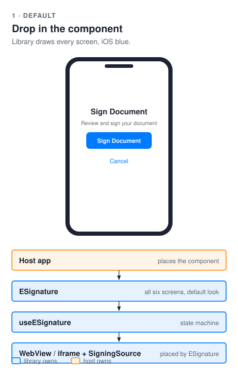
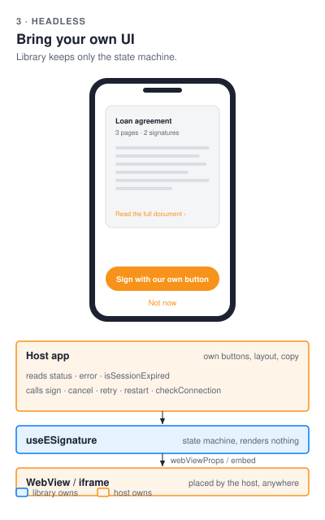

# @blinkbitcoin/esign-react-native

Plug-and-play e-signature signing flow for **React Native** apps, backed by
the e-sign GraphQL service. One component runs the whole flow: envelope
creation, embedded WebView signing, session-expiry restart, offline handling.

The web equivalent with the same public API is
[`@blinkbitcoin/esign-react`](../esign-react).

## Install

Published to **GitHub Packages** - see [docs/integration/consuming.md](../../docs/integration/consuming.md)
for the one-time `.npmrc` registry setup.

```sh
npm install @blinkbitcoin/esign-react-native
```

**Web Forms-only apps** (minimal footprint): import from the Apollo-free
`/webform` subpath and skip `@apollo/client` + `graphql` entirely - they are
optional peers needed only for proxy mode.

```tsx
import { ESignature, createWebFormsSource } from '@blinkbitcoin/esign-react-native/webform';
```

Peer dependencies your app provides (native modules must be owned by the host):

`react` · `react-native` · `react-native-webview` ·
`@react-native-community/netinfo` — plus `@apollo/client` · `graphql` (16.x)
**only for proxy mode** (optional peers; the `/webform` subpath needs neither) ·
`react-native-webview` · `@react-native-community/netinfo`

## Usage

The component is **provider-agnostic**: give it a `SigningSource` for the mode
you want. Three are built in.

```tsx
import {
  ESignature,
  createESignApolloClient,
  createProxySigningSource,
} from '@blinkbitcoin/esign-react-native';
import { ApolloProvider } from '@apollo/client/react';

// Mode 1 - Proxy: backend creates an envelope and returns an embedded URL.
const client = createESignApolloClient({
  uri: 'https://your-backend.example.com/graphql',
  getAuthToken: () => readTokenFromSecureStorage(), // sync or async, optional
});
const source = createProxySigningSource({
  client,
  contractType: 'loan_agreement',
  recipient: { name: 'Jane Doe', email: 'jane@example.com' },
});

<ApolloProvider client={client}>
  <ESignature
    source={source}
    onComplete={({ envelopeId }) => {/* signed */}}
    onError={({ code, message }) => {/* code is an ErrorCode or client-side fallback */}}
    onCancel={() => {/* user cancelled/declined */}}
  />
</ApolloProvider>
```

Other modes swap only the source (the component and callbacks are identical):

```tsx
// Mode 2 - DocuSign Web Forms (API-embedded): a thin backend mints the URL.
const source = createWebFormsSource({
  createInstance: () =>
    fetch('/onboarding/webform', { method: 'POST' }).then((r) => r.json()), // { url }
  allowedOrigin: 'https://apps.docusign.com',
});

// Mode 3 - Public Web Form URL (no backend; prefill via query params):
const source = createPublicUrlSource({ url, allowedOrigin: 'https://apps.docusign.com' });
```

### Integration paths

Same state machine in every column; the host takes over more of the screen
from left to right.

| Default | Themed | Headless |
|---|---|---|
|  |  |  |
| `<ESignature source={source} … />` | `theme` · `styles` · `labels` | `useESignature` + your own `WebView` |

### Theming

The default screens ship with the iOS-blue look. "Can we change the blue
button?" is a one-liner: pass `theme`. `styles` overrides individual
elements, `labels` overrides copy. Precedence is base look < `theme` <
`styles`; everything is optional and the default look/copy is unchanged when
nothing is passed. `label` still works (it is the default for
`labels.title` and `labels.sign`).

```tsx
<ESignature
  source={source}
  theme={{ primaryColor: '#F7931A', primaryTextColor: '#000' }}
  styles={{ button: { borderRadius: 4 }, title: { fontSize: 24 } }}
  labels={{ title: 'Sign your loan agreement', sign: 'Sign now', success: 'All done!' }}
  onComplete={...} onError={...} onCancel={...}
/>
```

`ESignatureTheme` keys: `primaryColor`, `primaryTextColor`, `mutedTextColor`,
`successColor`, `errorColor`, `warningColor`. `ESignatureStyles` keys are
listed in `ESignatureStyleKey` (`container`, `title`, `button`,
`buttonText`, `webview`, …). `ESignatureLabels` covers every string the
built-in screens render.

### Headless usage

When the built-in screens don't fit, `useESignature` runs the same state
machine (offline check, session-expiry restart, success delay) and renders
nothing - the host renders its own buttons and spreads `webViewProps` onto
its own `WebView`. `ESignature` is just one consumer of this hook.

```tsx
import { useESignature } from '@blinkbitcoin/esign-react-native';
import { WebView } from 'react-native-webview';

const {
  status, error, isSessionExpired, isCheckingConnection,
  sign, cancel, retry, restart, checkConnection,
  webViewProps, // null unless signing with a URL
} = useESignature({ source, onComplete, onError, onCancel });

if (status === 'signing' && webViewProps) {
  return <WebView {...webViewProps} style={{ flex: 1 }} />;
}
if (status === 'error') {
  return <MyButton onPress={isSessionExpired ? restart : retry} title="Try again" />;
}
if (status === 'offline') {
  return <MyButton onPress={checkConnection} disabled={isCheckingConnection} title="Check connection" />;
}
return <MyButton onPress={sign} title="Sign" />;
```

The hook still needs `react-native-webview` and
`@react-native-community/netinfo` installed (peers), and is also exported
from the Apollo-free `/webform` subpath.

## Public API

| Export | What it is |
|--------|------------|
| `ESignature` | The signing flow component (state machine: idle → loading → signing → success, plus error/offline). Takes a `source` prop, plus `theme` / `styles` / `labels` for the built-in screens. |
| `useESignature(options)` | The headless state machine behind `ESignature`: `status`, `error`, `isSessionExpired`, `isCheckingConnection`, `sign` / `cancel` / `retry` / `restart` / `checkConnection`, and `webViewProps` to spread onto your own `WebView`. Same options as the component minus the look props. |
| `createProxySigningSource` / `createWebFormsSource` / `createPublicUrlSource` | The three signing modes (`SigningSource`). Only the proxy is restartable. |
| `createESignApolloClient({ uri, getAuthToken })` | Apollo Client factory — host owns endpoint + token retrieval (proxy mode only) |
| `SigningSource`, `SigningSession`, `SigningEvent`, `isRestartable` | The abstraction, for writing a custom mode |
| `ErrorCode` (enum) / `ErrorCodes` (map) | The backend wire contract — generated from the service's GraphQL schema |
| `getErrorMessage(code, serverMessage?)` | Error-code → user-friendly copy |
| `CREATE_ENVELOPE_MUTATION`, `GET_SIGNING_URL_MUTATION` + types | The GraphQL operations, types generated from the schema |

Component behaviors worth knowing:

- **Session expiry**: a `session_timeout` event from the signing page keeps
  the envelope ID and offers a one-tap **Restart** (new signing URL, same
  envelope).
- **Offline**: connectivity is checked (NetInfo) before any API call;
  offline is a state with a "Check Connection" action, not an error.
- **testIDs**: every state exposes stable testIDs
  (`sign-document-button`, `loading-indicator`, `signing-webview`,
  `success-screen`, `error-message`, …) for E2E tooling.

## Development (in this monorepo)

```sh
make test        # 74 Jest tests, 100% coverage (enforced threshold)
make codegen     # regenerate types from ../../apps/api/schema.graphql
make build       # react-native-builder-bob (CJS + ESM + types)
```

Types in `src/generated/` are generated — edit the backend schema, not them.
`__mocks__/` ships WebView/NetInfo test doubles (also reused by the example
app's Jest config).

Example integration: [`examples/react-native-demo`](../../examples/react-native-demo).
